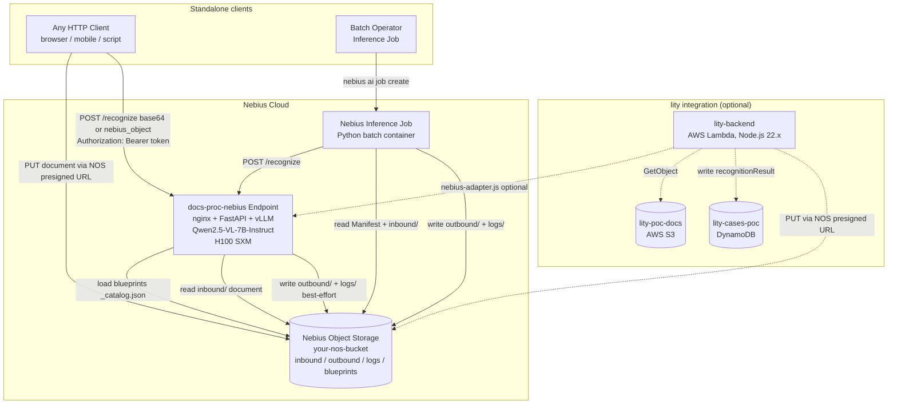
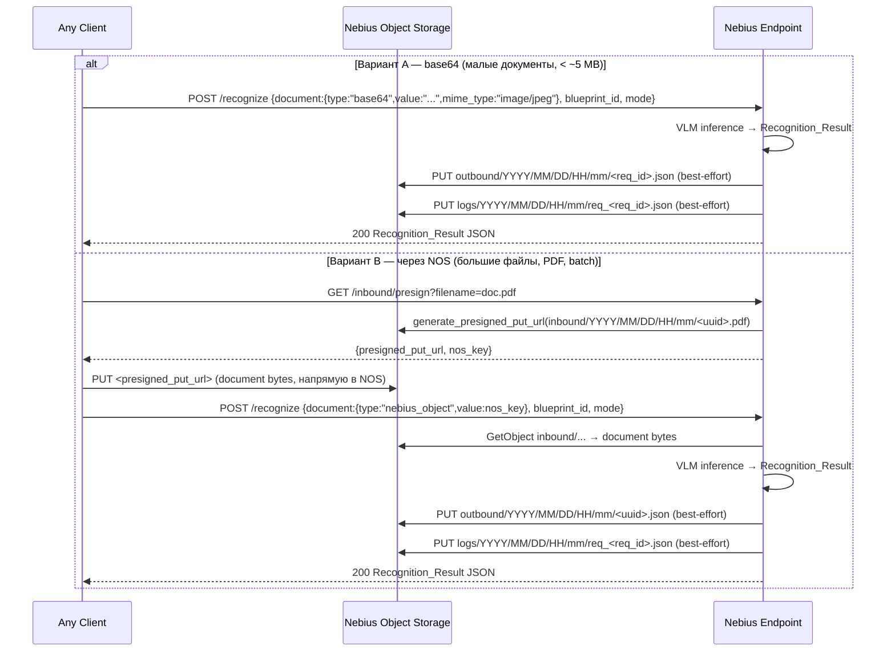
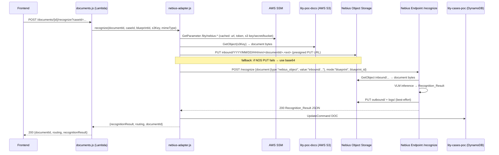
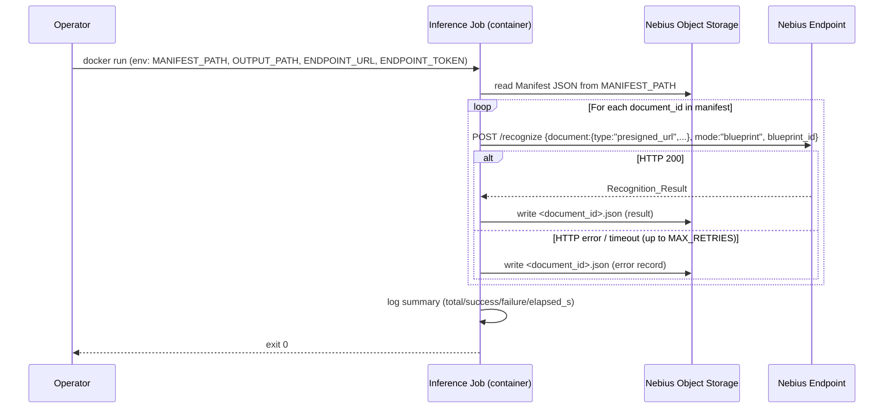

# Design Document: docs-proc-nebius — Nebius Document Recognition Pipeline

## Overview

This document describes the technical design for **docs-proc-nebius**: a standalone document recognition pipeline running on Nebius Serverless AI infrastructure, built on top of a Vision-Language Model (Qwen2.5-VL-7B-Instruct) and a versioned blueprint system.

**docs-proc-nebius is a first-class standalone product.** Any client — a browser, a mobile app, a backend service, a batch script — can use it directly via HTTP without any dependency on AWS, DynamoDB, or lity-backend. Nebius Object Storage is the only external dependency required for document transport and blueprint persistence.

The lity-backend integration (via `nebius-adapter.js`) is one specific client of the standalone API, not the primary use case.

The pipeline has two deployed components on Nebius:

1. **Endpoint** — a persistent nginx + FastAPI + vLLM HTTP service running Qwen2.5-VL-7B-Instruct on GPU H100 SXM. It accepts a document (`base64` inline, or `nebius_object` key in NOS) and returns a structured `Recognition_Result` JSON in the HTTP response.
2. **Inference Job** — a one-off containerized batch job that reads a Manifest from Nebius Object Storage, calls the Endpoint for each document, and writes per-document results back to Nebius Object Storage.

The lity-backend integration is described separately (see §5) and is decoupled from the core pipeline — the Endpoint has no knowledge of AWS, DynamoDB, or lity internals.

### Key design decisions

- **Standalone-first**: the Endpoint has zero runtime dependencies on AWS. Auth via Nebius endpoint Bearer token (same token for all clients). Documents via `base64` or NOS `nebius_object`. Results returned in HTTP response body + optionally persisted to NOS `outbound/`.
- **Model: Qwen2.5-VL-7B-Instruct** (not 72B). Fits in one H100 SXM (80 GB VRAM) with `max-model-len=32768` and `--limit-mm-per-prompt image=1,video=0`. The 72B variant would require multi-GPU tensor parallelism not supported by the current single-GPU preset.
- **Three-process container**: nginx (PID 1, :8080) → FastAPI (:8081, CPU logic) + vLLM (:8000, GPU). nginx routes `/v1/*` to vLLM directly; `/recognize`, `/blueprints`, `/health` to FastAPI.
- **Two-layer Docker**: heavy `Dockerfile.base` (vLLM + CUDA, built infrequently on Linux) + thin `Dockerfile` (app code, fast iteration).
- **Rich Blueprint Format + normalization**: blueprints stored on disk/NOS in rich JSON Schema format (sections, inferenceType, instruction). `BlueprintStore._normalize()` flattens them to `fields[]` at load time. Extractor works with flat list only.
- **Blueprint Catalog (`_catalog.json`)**: single index file drives startup load — only `active` blueprints are loaded. Enables `draft`/`deprecated` lifecycle without touching the Endpoint.
- **NOS as document transport for standalone clients**: any client uploads document to `inbound/YYYY/MM/DD/HH/mm/<id>.<ext>` via NOS presigned PUT URL, then calls `/recognize` with `document.type: "nebius_object"`. Or sends `base64` directly without NOS.
- **NOS outbound + logs**: Endpoint writes Recognition_Result to `outbound/` and request log to `logs/` after each recognition — best-effort, non-blocking (does not affect HTTP response timing or success).
- **Auth**: Nebius-managed auth proxy validates the Bearer token before traffic reaches the container. `AUTH_TOKEN` env var used for local CPU testing only — in production the Nebius proxy handles this.
- **lity-backend is one client**: `nebius-adapter.js` bridges AWS S3 → NOS and DynamoDB write. It is optional and decoupled. The Endpoint does not know about it.
- **start.sh launch order**: vLLM (background, poll `/health` up to 300 s) → FastAPI (background, wait 2 s) → nginx (foreground, PID 1). If vLLM dies, `start.sh` exits with code 1.
- **`--limit-mm-per-prompt image=1`**: critical. `5 images × 16384 tokens = 81920 > 32768` → OOM.

---

## Architecture

### System Context (C4 Level 1)



**Standalone usage** — два варианта передачи документа:

```
Вариант A (base64, прямой):
  Client → POST /recognize { document: { type: "base64", value: "...", mime_type: "image/jpeg" } }
         ← 200 Recognition_Result JSON

Вариант B (через NOS):
  1. Client → GET /inbound/presign?filename=doc.jpg  (новый endpoint, опционально)
           ← { presigned_put_url, nos_key }
  2. Client → PUT <presigned_put_url>  (прямо в NOS)
  3. Client → POST /recognize { document: { type: "nebius_object", value: nos_key } }
           ← 200 Recognition_Result JSON
```

Оба варианта не требуют AWS, DynamoDB, или lity-backend.

### NOS Bucket Structure

```
your-nos-bucket/
│
├── blueprints/
│   ├── _catalog.json                    ← реестр всех blueprints (единая точка входа)
│   ├── default/
│   │   └── v1.json                      ← catch-all blueprint
│   ├── passport/
│   │   └── v1.json
│   └── residence_permit_ltu_front/
│       └── v1.json
│
├── inbound/
│   └── YYYY/MM/DD/HH/mm/
│       └── <document_id>.<ext>          ← загружен lity-backend перед /recognize
│
├── outbound/
│   └── YYYY/MM/DD/HH/mm/
│       └── <document_id>.json           ← Recognition_Result (пишет Endpoint)
│
└── logs/
    └── YYYY/MM/DD/HH/mm/
        ├── req_<request_id>.json        ← лог каждого /recognize запроса
        └── job_<job_id>.json            ← summary batch job
```

### Blueprint Catalog (`blueprints/_catalog.json`)

```json
{
  "schema_version": "1.0",
  "updated_at": "2026-06-09T19:00:00Z",
  "blueprints": [
    {
      "id": "default",
      "name": "Default (catch-all)",
      "status": "active",
      "latest_version": 1,
      "path": "blueprints/default/v1.json",
      "created_at": "2026-06-09T00:00:00Z",
      "updated_at": "2026-06-09T00:00:00Z"
    },
    {
      "id": "passport",
      "name": "Passport (international)",
      "status": "active",
      "latest_version": 1,
      "path": "blueprints/passport/v1.json",
      "created_at": "2026-06-09T00:00:00Z",
      "updated_at": "2026-06-09T00:00:00Z"
    },
    {
      "id": "residence_permit_ltu_front",
      "name": "ВНЖ Литвы (лицевая сторона)",
      "status": "active",
      "latest_version": 1,
      "path": "blueprints/residence_permit_ltu_front/v1.json",
      "created_at": "2026-06-09T00:00:00Z",
      "updated_at": "2026-06-09T00:00:00Z"
    }
  ]
}
```

Статусы: `active` | `draft` | `deprecated`. `BlueprintStore` загружает только `active` при старте.

### Request Routing (nginx layer)

```
Client → [Nebius Auth Proxy] → nginx :8080
                                  ├── /v1/*        → vLLM :8000  (GPU inference, direct)
                                  ├── /recognize   → FastAPI :8081
                                  ├── /blueprints* → FastAPI :8081
                                  ├── /health      → FastAPI :8081
                                  │                   (fallback @vllm_health_fallback → vLLM :8000)
                                  └── @fastapi_down → 503 JSON (degraded mode)
```

### Container Startup Sequence

```mermaid
sequenceDiagram
    participant S as start.sh
    participant V as vLLM :8000
    participant F as FastAPI :8081
    participant N as nginx :8080

    S->>V: python3 -m vllm.entrypoints.openai.api_server & (background)
    loop Poll every 2s, max 300s
        S->>V: curl http://127.0.0.1:8000/health
        V-->>S: 200 OK (when ready)
    end
    S->>F: uvicorn app.main:app --host 127.0.0.1 --port 8081 & (background)
    S->>N: exec nginx -g 'daemon off;' (foreground, PID 1)
```

### Standalone Recognition Flow (primary)



### lity-backend Recognition Flow (optional integration)



### Batch Job Flow



---

## Components and Interfaces

### 1. Nebius Endpoint

**Location**: `nebius-endpoint/`

#### File structure

```
nebius-endpoint/
├── Dockerfile              # Thin layer: FROM base:v2, copies app/ + config
├── Dockerfile.base         # Heavy layer: vLLM + CUDA + poppler-utils (build on Linux only)
├── Dockerfile.cpu          # CPU variant for local dev (no CUDA)
├── docker-compose.cpu.yml  # Local CPU test stack (MOCK_VLLM=1)
├── .dockerignore           # Excludes app.bak/, .git, venv, __pycache__
├── start.sh                # Entrypoint: vLLM → FastAPI → nginx (foreground)
├── nginx.conf              # Reverse proxy: /v1/* → vLLM, rest → FastAPI
├── requirements.txt        # FastAPI, httpx, boto3, python-multipart, hypothesis
├── app/
│   ├── __init__.py
│   ├── main.py             # FastAPI app, all routes, lifespan
│   ├── auth.py             # verify_token dependency (no-op: Nebius proxy handles auth)
│   ├── config.py           # Config class from env vars
│   ├── models.py           # Pydantic request/response models
│   ├── extractor.py        # Document preprocessing, VLM calls, field extraction, routing
│   ├── blueprint_loader.py # BlueprintStore: S3-backed CRUD + in-memory cache
│   ├── pdf_converter.py    # PDF → JPEG via poppler (pdf_to_single_page_image)
│   └── mock_vllm.py        # Deterministic mock responses for CPU testing
└── tests/
    ├── conftest.py          # Fixtures: blueprint loading, mock vLLM client, sample docs
    └── test_router.py       # P1, P2 — Hypothesis PBT for routing/clamping logic
```

#### GET /inbound/presign

Генерирует NOS presigned PUT URL для загрузки документа клиентом напрямую в NOS. Используется в standalone Варианте B.

Query params: `filename=<original_filename>` (используется для определения расширения)

Response (HTTP 200):
```json
{
  "presigned_put_url": "https://storage.eu-north1.nebius.cloud/your-nos-bucket/inbound/2026/06/09/19/32/a1b2c3d4.jpg?X-Amz-Signature=...",
  "nos_key": "inbound/2026/06/09/19/32/a1b2c3d4.jpg",
  "expires_in": 300
}
```

Клиент выполняет `PUT <presigned_put_url>` с байтами документа, затем передаёт `nos_key` в запрос `/recognize`.

Если NOS не настроен (`S3_ACCESS_KEY` пуст) → HTTP 503 `{ "message": "Object storage not configured" }`.

#### POST /recognize

Request body (`RecognizeRequest`):
```json
{
  "document": {
    "type": "presigned_url" | "base64" | "nebius_object",
    "value": "<url or base64 string or object key>",
    "mime_type": "image/jpeg",
    "page": 1
  },
  "mode": "blueprint",
  "blueprint_id": "passport",
  "options": {
    "include_confidence": true,
    "confidence_mode": "both",
    "document_type_hint": null,
    "include_bounding_boxes": false
  }
}
```

Response (`RecognizeResponse`, HTTP 200):
```json
{
  "mode": "blueprint",
  "blueprint_id": "passport",
  "document_confidence": 91,
  "routing": "auto_classified",
  "document_part": "single",
  "fields": {
    "surname": { "value": "SMITH", "confidence": 98 },
    "given_names": { "value": "JOHN WILLIAM", "confidence": 97 },
    "date_of_birth": { "value": "1985-03-22", "confidence": 94 },
    "document_number": { "value": "AB1234567", "confidence": 99 },
    "issuing_country": { "value": "GBR", "confidence": 97 },
    "nationality": { "value": "GBR", "confidence": 95 },
    "sex": { "value": "M", "confidence": 99 },
    "mrz_line_1": { "value": "P<GBRSMITH<<JOHN<WILLIAM<<<<<<<<<<<<<<<<<<<", "confidence": 92 },
    "mrz_line_2": { "value": "AB12345671GBR8503221M3010312<<<<<<<<<<<<<<<6", "confidence": 91 }
  }
}
```

`mode="raw"` response:
```json
{ "mode": "raw", "document_part": "single", "raw_text": "This document shows..." }
```

`mode="auto"` response:
```json
{
  "mode": "auto",
  "blueprint_id": "passport",
  "document_confidence": 88,
  "routing": "auto_classified",
  "document_part": "single",
  "classification": { "document_type": "Passport", "blueprint_id": "passport", "confidence": 88 },
  "fields": { ... }
}
```

Error responses (all formats `{ "detail": "<message>" }` from Pydantic/FastAPI, or `{ "message": "..." }` from HTTPException):
- `422` — missing/unknown `blueprint_id`, failed Pydantic validation
- `503` — Object storage not configured (for `nebius_object` type without S3 credentials)
- `503` — vLLM unavailable
- `504` — processing timeout (>30 s)

#### GET /health

```json
{
  "status": "healthy",
  "vllm": "up",
  "fastapi": "up",
  "gpu_enabled": true,
  "mock_mode": false,
  "model": "Qwen2.5-VL-7B-Instruct",
  "uptime_seconds": 3612.4,
  "blueprints_loaded": 4
}
```

Returns HTTP 200 when vLLM is up, HTTP 503 when degraded (FastAPI still responds).

#### Environment variables (Config class)

| Variable | Description | Default |
|---|---|---|
| `VLLM_BASE_URL` | Internal vLLM URL | `http://127.0.0.1:8000` |
| `VLLM_MODEL_NAME` | Model name sent in vLLM payloads | `Qwen2.5-VL-7B-Instruct` |
| `GPU_ENABLED` | Whether GPU/vLLM is active | `1` |
| `MOCK_VLLM` | Replace vLLM with mock (CPU testing) | `0` |
| `S3_ENDPOINT` | Nebius Object Storage endpoint | `https://storage.eu-north1.nebius.cloud` |
| `S3_BUCKET` | Bucket for blueprints + uploads | `your-nos-bucket` |
| `S3_ACCESS_KEY` | Nebius SA static key ID | `""` (local-only if empty) |
| `S3_SECRET_KEY` | Nebius SA static secret key | `""` |
| `S3_REGION` | S3 signature region | `eu-north1` |
| `VLLM_TIMEOUT` | vLLM HTTP timeout (seconds) | `120` |
| `FETCH_TIMEOUT` | Timeout for fetching presigned URLs | `30` |
| `PDF_DPI` | DPI for PDF→JPEG conversion | `200` |
| `PDF_MAX_PAGES` | Max allowed PDF pages | `50` |

#### vLLM launch parameters (start.sh)

```bash
python3 -m vllm.entrypoints.openai.api_server \
    --model Qwen/Qwen2.5-VL-7B-Instruct \
    --served-model-name "Qwen2.5-VL-7B-Instruct" \
    --host 127.0.0.1 --port 8000 \
    --dtype bfloat16 \
    --max-model-len 32768 \
    --limit-mm-per-prompt image=1,video=0 \
    --gpu-memory-utilization 0.85 \
    --trust-remote-code
```

**Critical:** `--limit-mm-per-prompt image=1` (not 5). `5 × 16384 = 81920 > 32768` → OOM.

---

### 2. BlueprintStore (`app/blueprint_loader.py`)

The `BlueprintStore` class manages the in-memory blueprint cache and its NOS persistence layer.

#### Initialization flow

1. Read `blueprints/_catalog.json` from NOS.
2. For each entry with `status: "active"`, fetch the file at `path` and call `_normalize()`.
3. If catalog is missing → fallback: scan `blueprints/*/` for highest `vN.json`, load all.
4. If credentials absent → local-only mode (empty cache, no NOS operations).

#### Rich Blueprint Format (on-disk / NOS)

Matches `ltu-prp-scheme-front.json` structure extended with system metadata:

```json
{
  "$schema": "http://json-schema.org/draft-07/schema#",
  "id": "passport",
  "name": "Passport (international)",
  "version": 1,
  "status": "active",
  "description": "International travel passport, any issuing country",
  "extraction_prompt": "Extract all personal identification and travel document fields.",
  "document_parts": ["single"],
  "sections": {
    "DOCUMENT_METADATA": {
      "document_type":   { "inferenceType": "explicit", "instruction": "Type as printed, e.g. PASSPORT",     "required": true },
      "document_number": { "inferenceType": "explicit", "instruction": "Exact document number as printed",   "required": true },
      "issuing_country": { "inferenceType": "explicit", "instruction": "ISO 3166-1 alpha-3 code, e.g. GBR", "required": true }
    },
    "PERSONAL_INFO": {
      "surname":       { "inferenceType": "explicit", "instruction": "Uppercase as printed",      "required": true },
      "given_names":   { "inferenceType": "explicit", "instruction": "Uppercase as printed",      "required": true },
      "sex":           { "inferenceType": "inferred", "instruction": "M or F",                    "required": true },
      "nationality":   { "inferenceType": "explicit", "instruction": "ISO 3166-1 alpha-3 code",   "required": true },
      "date_of_birth": { "inferenceType": "inferred", "instruction": "YYYY-MM-DD",                "required": true }
    },
    "DOCUMENT_DETAILS": {
      "date_of_expiry": { "inferenceType": "inferred", "instruction": "YYYY-MM-DD",               "required": true },
      "date_of_issue":  { "inferenceType": "inferred", "instruction": "YYYY-MM-DD if present",    "required": false },
      "mrz_line_1":     { "inferenceType": "explicit", "instruction": "Verbatim 44-char MRZ line","required": false },
      "mrz_line_2":     { "inferenceType": "explicit", "instruction": "Verbatim 44-char MRZ line","required": false }
    }
  },
  "created_at": "2026-06-09T00:00:00Z",
  "updated_at": "2026-06-09T00:00:00Z"
}
```

#### `_normalize(rich)` → flat fields[]

```python
def _normalize(self, rich: dict) -> dict:
    """Flatten sections → fields[] for the Extractor."""
    fields = []
    for section_name, section_fields in rich.get("sections", {}).items():
        for field_name, field_meta in section_fields.items():
            fields.append({
                "name": field_name,
                "description": field_meta.get("instruction", ""),
                "instruction": field_meta.get("instruction", ""),
                "inferenceType": field_meta.get("inferenceType", "explicit"),
                "required": field_meta.get("required", True),
                "_section": section_name  # kept for logging
            })
    normalized = dict(rich)
    normalized["fields"] = fields
    return normalized
```

The Extractor receives the normalized form and works with `blueprint["fields"]` as before. The `inferenceType` field is available per-field for future prompt differentiation.

#### CRUD + versioning

| Operation | NOS writes | `_catalog.json` update |
|---|---|---|
| `POST /blueprints` | `blueprints/<id>/v1.json` | Add entry, `status: "active"`, `latest_version: 1` |
| `PUT /blueprints/{id}` | `blueprints/<id>/vN.json` (new version) | Update `latest_version: N`, `updated_at` |
| `DELETE /blueprints/{id}` | No file deletion | Set `status: "deprecated"` |
| `POST /blueprints/reload` | — | Reload from catalog |
| `POST /blueprints/generate` | `blueprints/<id>/v1.json` | Add entry, `status: "draft"` |

#### Default blueprint (catch-all)

```json
{
  "id": "default",
  "name": "Default (catch-all)",
  "description": "Extracts all visible fields from any unknown document type.",
  "extraction_prompt": "Extract ALL visible structured information from this document. Return every field, number, date, name, identifier, and authority you can find.",
  "document_parts": ["single"],
  "sections": {
    "DOCUMENT_METADATA": {
      "document_type":     { "inferenceType": "explicit", "instruction": "Best guess at document type",       "required": false },
      "document_number":   { "inferenceType": "explicit", "instruction": "Any document or reference number",  "required": false },
      "issuing_country":   { "inferenceType": "explicit", "instruction": "ISO code if identifiable",          "required": false },
      "issuing_authority": { "inferenceType": "explicit", "instruction": "Name of issuing authority",         "required": false }
    },
    "PERSONAL_INFO": {
      "full_name":     { "inferenceType": "explicit", "instruction": "Full name as it appears",     "required": false },
      "date_of_birth": { "inferenceType": "inferred", "instruction": "YYYY-MM-DD if present",       "required": false },
      "nationality":   { "inferenceType": "explicit", "instruction": "ISO code if present",         "required": false }
    },
    "DOCUMENT_DETAILS": {
      "date_of_issue":  { "inferenceType": "inferred", "instruction": "YYYY-MM-DD if present",      "required": false },
      "date_of_expiry": { "inferenceType": "inferred", "instruction": "YYYY-MM-DD if present",      "required": false },
      "other_fields":   { "inferenceType": "explicit", "instruction": "Any other key-value pairs as JSON object", "required": false }
    }
  }
}
```

#### NOS client configuration (same as before)

```python
boto3.client("s3",
    endpoint_url="https://storage.eu-north1.nebius.cloud",
    aws_access_key_id=S3_ACCESS_KEY,
    aws_secret_access_key=S3_SECRET_KEY,
    region_name="eu-north1",
    config=BotoConfig(signature_version="s3v4")
)
```

---

### 3. Blueprint Generation (`POST /blueprints/generate`)

Two-pass VLM workflow:

```
Pass 1 (mode=raw):   document image → free-text description of all visible fields
Pass 2 (structured): raw text + prompt → Rich Blueprint JSON (sections + inferenceType)
```

The second pass uses a system prompt that instructs the VLM to output valid JSON in Rich Blueprint Format. The result is saved as `status: "draft"` — not loaded into the active BlueprintStore until explicitly activated.

---

---

### 3. Extractor (`app/extractor.py`)

Core extraction logic. All functions are pure (no side effects beyond logging) and testable without a GPU.

#### Document preprocessing (`preprocess_document`)

```
document.type=presigned_url  → image_content = {"type": "image_url", "image_url": {"url": "<url>"}}
document.type=base64         → image_content = {"type": "image_url", "image_url": {"url": "data:<mime>;base64,<value>"}}
document.type=nebius_object  → fetch from S3 → same as base64 path
mime_type=application/pdf    → pdf_bytes → pdf_to_single_page_image(page=N) → base64 JPEG
```

#### Routing and confidence clamping

```python
def clamp_confidence(raw: float) -> int:
    return max(0, min(100, round(raw)))

def determine_routing(confidence: int) -> str:
    if confidence >= 85:   return "auto_classified"
    if confidence >= 50:   return "review_required"
    return "escalate_to_operator"

def calculate_document_confidence(fields: dict) -> int:
    confs = [f.confidence for f in fields.values() if f.confidence is not None]
    return max(0, min(100, round(sum(confs) / len(confs)))) if confs else 0
```

These functions live in `extractor.py`. Tests in `test_router.py` import them as `from app.extractor import clamp_confidence, determine_routing` (note: an `app/router.py` stub may need to be created to satisfy existing test imports — see Testing section).

#### VLM call (`call_vllm`)

```python
payload = {
    "model": Config.VLLM_MODEL_NAME,
    "messages": [
        {"role": "system", "content": system_prompt},
        {"role": "user", "content": [image_content, {"type": "text", "text": user_prompt}]}
    ],
    "max_tokens": 4096,
    "temperature": 0.0,
    "logprobs": True,                      # Req 13 — always on for extraction calls
    "extra_body": {"guided_json": schema}  # Req 14 — blueprint-derived JSON Schema (extraction modes only)
}
response = await http_client.post("/v1/chat/completions", json=payload)
```

`call_vllm` returns `(text, logprobs_content)` where `logprobs_content = choices[0].logprobs.content` — a list of `{token, logprob}` entries. When `MOCK_VLLM=1`, `mock_vllm.py` returns deterministic fixture responses **including synthetic logprobs** so the confidence path runs on CPU.

#### Guided JSON schema builder (`blueprint_to_guided_schema`)

```python
def blueprint_to_guided_schema(blueprint: dict) -> dict:
    """Blueprint fields[] → JSON Schema for vLLM guided_json (Req 14)."""
    return {
        "type": "object",
        "properties": {f["name"]: {"type": ["string", "null"]} for f in blueprint["fields"]},
        "required": [f["name"] for f in blueprint["fields"]],
        "additionalProperties": False,
    }
```

- Flat scalar values only — **no** nested `{value, confidence}`: confidence comes from logprobs, halving output tokens.
- On a vLLM guided-backend error: retry once without `guided_json`, log `guided_json_fallback`, parse via legacy fallback chain.
- `POST /blueprints/generate` Pass 2 uses a static meta-schema of the Rich Blueprint Format.

#### Logprob confidence (`logprob_confidence`) — Req 13

```python
def logprob_confidence(value: str, full_text: str, logprobs_content: list) -> tuple[int, str]:
    """Confidence for one field value from token logprobs.
    Returns (confidence 0-100, source: 'logprobs' | 'response_mean')."""
    # 1. Reconstruct char offsets: cumulative lengths of logprobs_content[i].token
    # 2. Find span of `value` in full_text (first occurrence after the field name key)
    # 3. Collect logprobs of tokens overlapping the span
    # 4. confidence = clamp(round(100 * exp(mean(lps))))
    # Fallback (span not found): mean over ALL tokens → source='response_mean'
```

- `FieldResult` gains `confidence_source: "logprobs" | "response_mean" | "model_reported" | "mock"`.
- `mode=auto` classification confidence: same function over the predicted `blueprint_id` tokens.
- `double_check` adjustments (+10 / →0 / →60) apply **on top of** logprob base scores.
- Legacy flat-80 path survives only when the vLLM response carries no logprobs (`confidence_source: "model_reported"`).

#### JSON parsing fallback (`parse_json_response`) — legacy path only

Needed only when guided decoding is unavailable (Req 14.2):

1. Strip markdown fences (` ```json ... ``` `)
2. Try `json.loads(cleaned)`
3. Fallback: regex `\{[\s\S]*\}` search on raw response
4. If all fail: return `{}`

#### Packet processing (`mode="packet"`) — Req 16

```
PDF → pdf_to_images(all pages, cap PDF_MAX_PAGES)
  → classify each page (auto-mode classification call, logprob confidence)
  → group consecutive pages with same blueprint_id into logical documents
  → extract once per logical document (first page as representative image;
    multi-image extraction deferred — --limit-mm-per-prompt image=1)
  → response: { documents: [ {pages, blueprint_id, classification, fields,
                document_confidence, routing} ], routing: <most conservative> }
```

Non-PDF input behaves as `mode=auto` (packet of one). >`PDF_MAX_PAGES` pages → HTTP 422. Unclassifiable page → logical document with `blueprint_id: null`, `raw_text`, `routing: "escalate_to_operator"`.

---

### 4. nebius-adapter.js (`lity-backend/nebius-adapter.js`)

The only module in lity-backend that knows about Nebius. Called from `documents.js`.

```javascript
async function recognize({ ssm, ddb, s3, documentId, caseId, s3Key, blueprintId, mimeType, casesTable })
```

**Execution steps:**

1. Fetch all SSM parameters in parallel (all module-level cached):
   - `/lity/nebius-endpoint-url`, `/lity/nebius-endpoint-token`
   - `/lity/nebius-s3-access-key`, `/lity/nebius-s3-secret-key`, `/lity/nebius-s3-bucket`
   - `/lity/docs-bucket-name`
2. `s3.GetObject({Bucket: docsBucket, Key: s3Key})` → document bytes
3. Build NOS key: `inbound/YYYY/MM/DD/HH/mm/<documentId>.<ext>`
4. Generate NOS presigned PUT URL (TTL 300s) via `@aws-sdk/client-s3` pointed at `https://storage.eu-north1.nebius.cloud`
5. `fetch(nosPutUrl, { method: 'PUT', body: documentBytes })` → upload to NOS
6. If NOS upload fails → fallback: generate AWS presigned GET URL, use `document.type: "presigned_url"`
7. `fetch(endpointUrl + '/recognize', { Authorization: Bearer token, body: { document: {type:"nebius_object", value: nosKey}, mode:"blueprint", blueprint_id } })`
8. On HTTP 200: `ddb.send(UpdateCommand(...))` — set `recognitionResult`, `recognitionRouting`, `recognitionStatus`, `recognitionAt`
9. Return `{ recognitionResult, routing, documentId }` on success; `{ error, documentId }` on failure — never throw.

**SSM parameters:**

| Parameter | Type | Description |
|---|---|---|
| `/lity/nebius-endpoint-url` | String | Base URL, e.g. `http://<YOUR-ENDPOINT-IP>:8080` |
| `/lity/nebius-endpoint-token` | SecureString | Bearer token from `nebius ai endpoint create` |
| `/lity/nebius-s3-access-key` | SecureString | NOS static key ID |
| `/lity/nebius-s3-secret-key` | SecureString | NOS static secret key |
| `/lity/nebius-s3-bucket` | String | `your-nos-bucket` |
| `/lity/docs-bucket-name` | String | AWS S3 bucket (shared with documents.js) |

**⚠️ Operational note:** `/lity/nebius-endpoint-url` and `/lity/nebius-endpoint-token` must be updated in SSM after every `nebius ai endpoint create`.

---

### 5. Nebius Inference Job (`nebius-job/`)

```
nebius-job/
├── Dockerfile
├── job.py           # Main entry: read manifest → call endpoint → write results
├── requirements.txt # httpx, boto3
└── tests/
    └── test_job.py  # P6, P7 — Hypothesis PBT
```

**Manifest format** (read from `$MANIFEST_PATH` in Nebius Object Storage):
```json
{
  "documents": [
    { "document_id": "uuid-1", "blueprint_id": "passport", "presigned_url": "https://...", "mime_type": "image/jpeg" }
  ]
}
```

**Environment variables:**

| Variable | Description | Default |
|---|---|---|
| `MANIFEST_PATH` | Nebius Object Storage key for input manifest | required |
| `OUTPUT_PATH` | Nebius Object Storage key prefix for output files | required |
| `ENDPOINT_URL` | Full URL of the Nebius Endpoint | required |
| `ENDPOINT_TOKEN` | Bearer token for Endpoint auth | required |
| `MAX_RETRIES` | Max retry attempts per document | `10` |
| `REQUEST_TIMEOUT_S` | Per-request timeout in seconds | `60` |
| `S3_ENDPOINT` | Nebius Object Storage endpoint | `https://storage.eu-north1.nebius.cloud` |
| `S3_BUCKET` | Bucket name | required |
| `S3_ACCESS_KEY` | Nebius SA static key ID | required |
| `S3_SECRET_KEY` | Nebius SA static secret key | required |

**Error record format:**
```json
{ "document_id": "uuid-1", "status": "error", "error": "HTTP 503 after 10 retries", "attempts": 10, "elapsed_ms": 45231 }
```

---

### 6. Evaluation Job — MIDV-2020 benchmark (Req 15)

Extension of `nebius-job` activated by `JOB_MODE=eval`. Same container image — one extra branch in `job.py` plus `eval_metrics.py`.

```
nebius-job/
├── job.py            # JOB_MODE=batch (default) | eval
├── eval_metrics.py   # exact-match, normalized Levenshtein, calibration buckets
└── scripts/
    └── prepare_midv2020.sh   # download public subset → build manifest → upload to NOS eval/midv2020/
```

**Eval manifest** (`eval/midv2020/manifest.json`), built by `prepare_midv2020.sh` from MIDV-2020 annotations:
```json
{
  "documents": [
    {
      "document_id": "esp_id_42",
      "blueprint_id": "id_card",
      "nos_key": "eval/midv2020/images/esp_id/42.jpg",
      "ground_truth": { "surname": "GARCIA", "given_names": "MARIA", "date_of_birth": "1990-01-15" }
    }
  ]
}
```

**Metrics per document** (written to `eval/results/<job_id>/<document_id>.json`): per-field `{extracted, expected, exact_match, levenshtein_sim, confidence, confidence_source}`, `latency_ms`.

**Summary report** (`eval/reports/<job_id>.json`):
```json
{
  "job_id": "...", "documents": 50, "doc_types": ["passport", "id_card"],
  "per_field_accuracy":   { "surname": 0.96, "date_of_birth": 0.92 },
  "per_type_accuracy":    { "esp_id": 0.94, "grc_passport": 0.91 },
  "calibration": { "mean_conf_correct": 87.2, "mean_conf_incorrect": 54.1 },
  "latency_ms": { "p50": 2100, "p95": 4800 },
  "gpu_cost_estimate_usd": 0.31
}
```

The `calibration` block is the headline number for the blog post: it demonstrates that logprob confidence actually separates correct from incorrect extractions (the flat-80 baseline cannot).

**Dataset scope**: ≥50 documents, ≥3 types (e.g., `esp_id`, `grc_passport`, `srb_passport`). New built-in blueprint `id_card` added alongside `passport`; both reused for matching MIDV types.

---

### 7. Demo UI (`GET /demo`) — Req 17

Single static file `app/static/demo.html` served by FastAPI (`FileResponse`), vanilla JS, no build step.

- Inputs: Bearer token (never persisted), file picker (image/PDF), mode selector, blueprint selector (populated from `GET /blueprints`).
- Output: fields table with confidence bars color-coded by routing band (green ≥85 / yellow 50–84 / red <50), `document_confidence`, `routing`, latency; bounding-box overlay on `<canvas>` when present.
- One-click sample MIDV-2020 images bundled at `app/static/samples/` (synthetic data — PII-safe by construction).
- Endpoint URL defaults to `window.location.origin`; nothing hardcoded.
- nginx: `location /demo` + `/static` → FastAPI.

---

### 8. Public repository & PII compliance (Req 11.7–11.9)

The contest deliverable is a **separate public repo `docs-proc-nebius`** with fresh git history (no lity monorepo history — it contains real client documents and credentials in past commits).

```
docs-proc-nebius/            ← new public repo, MIT license
├── README.md                # self-contained: architecture, setup, eval, costs
├── LICENSE                  # MIT
├── .env.example             # all secrets as placeholders
├── nebius-endpoint/         # exported, sanitized (no *.bak, no real docs)
├── nebius-job/              # batch + eval modes
├── eval/                    # prepare_midv2020.sh, sample report
└── docs/                    # architecture diagram, blog draft, video script
```

**Export script** `scripts/export_public.sh` (lives in lity monorepo, NOT in public repo): rsync whitelist of the two workstream dirs minus exclusions (`*.bak`, `app.bak/`, `IMG_*.jpeg`, `BC new.pdf`, `test4.pdf`, `__pycache__`, smoke-test params), then placeholder-substitution pass, then `gitleaks detect` (or equivalent grep sweep for `Bearer `, key IDs, IPs) as a release gate.

**Sanitization rules:**
- `smoke_test.sh`: `BASE_URL`/`TOKEN`/`ENDPOINT_ID` read from env (`${NEBIUS_ENDPOINT_URL:?}`), defaults removed.
- All sample outputs/screenshots regenerated from MIDV-2020 documents only.
- Bucket name parameterized (`S3_BUCKET`), nothing assumes `your-nos-bucket`.

---

## Data Models

### Recognition_Result (HTTP response + NOS outbound)

Возвращается в теле HTTP 200 ответа при любом `/recognize` запросе. Дополнительно записывается в NOS `outbound/YYYY/MM/DD/HH/mm/<request_id>.json` (best-effort).

```json
{
  "request_id": "a1b2c3d4-...",
  "blueprint_id": "passport",
  "document_confidence": 91,
  "routing": "auto_classified",
  "document_part": "single",
  "mode": "blueprint",
  "fields": {
    "surname":        { "value": "SMITH",        "confidence": 98, "confidence_source": "logprobs" },
    "given_names":    { "value": "JOHN WILLIAM", "confidence": 97, "confidence_source": "logprobs" },
    "date_of_birth":  { "value": "1985-03-22",   "confidence": 94, "confidence_source": "logprobs" },
    "document_number":{ "value": "AB1234567",    "confidence": 99, "confidence_source": "logprobs" },
    "issuing_country":{ "value": "GBR",          "confidence": 97, "confidence_source": "logprobs" },
    "nationality":    { "value": "GBR",          "confidence": 95, "confidence_source": "logprobs" },
    "sex":            { "value": "M",            "confidence": 99, "confidence_source": "logprobs" },
    "mrz_line_1":     { "value": "P<GBRSMITH<<JOHN<WILLIAM<<<<<<<<<<<<<<<<<<<", "confidence": 92, "confidence_source": "logprobs" },
    "mrz_line_2":     { "value": "AB12345671GBR8503221M3010312<<<<<<<<<<<<<<<6", "confidence": 91, "confidence_source": "response_mean" }
  }
}
```

`confidence_source` values: `"logprobs"` (token-level, Req 13.2), `"response_mean"` (span not located, Req 13.3), `"model_reported"` (legacy, logprobs absent), `"mock"` (CPU test mode).

### Packet result (`mode="packet"`) — Req 16

```json
{
  "request_id": "...", "mode": "packet", "routing": "review_required",
  "documents": [
    { "pages": [1, 2], "blueprint_id": "passport", "classification": { "document_type": "Passport", "confidence": 93 },
      "fields": { "...": {} }, "document_confidence": 91, "routing": "auto_classified" },
    { "pages": [3],   "blueprint_id": null, "classification": null,
      "raw_text": "...", "document_confidence": null, "routing": "escalate_to_operator" }
  ]
}
```

### DynamoDB item (lity integration only — optional)

Записывается только когда используется `nebius-adapter.js`. Endpoint ничего не знает об этой записи.

| Attribute | Type | Description |
|---|---|---|
| `recognitionResult` | Map | Full Recognition_Result JSON |
| `recognitionRouting` | String | Top-level `routing` value (denormalized) |
| `recognitionStatus` | String | `"completed"` or `"failed"` |
| `recognitionAt` | String | ISO 8601 timestamp |
| `recognitionError` | String | Error description if status is `"failed"` |

DynamoDB key structure: `{ PK: "CASE#<caseId>", SK: "DOC#<documentId>" }`

---

## Correctness Properties

### Property 1: Routing is always a valid, unique value

*For any* integer `confidence` in [0, 100], `determine_routing(confidence)` SHALL return exactly one of `{"auto_classified", "review_required", "escalate_to_operator"}`. The three bands [0,49], [50,84], [85,100] are mutually exclusive and exhaustive.

**Validates: Requirements 3.1, 3.2, 3.3, 3.5**

### Property 2: Out-of-range confidence is clamped then routed

*For any* finite float `raw`, `clamp_confidence(raw)` SHALL return an `int` in [0, 100] and `determine_routing(clamp_confidence(raw))` SHALL return a valid routing string.

**Validates: Requirements 3.4**

### Property 3: Required fields are never omitted from the Recognition_Result

*For any* blueprint and any document, every field in `blueprint["fields"]` SHALL appear in `Recognition_Result.fields`. Missing fields SHALL appear as `{ "value": null, "confidence": 0 }`.

**Validates: Requirements 2.1, 2.2**

### Property 4: All field confidence scores are integers in [0, 100]

*For any* `Recognition_Result`, every `fields[*].confidence` SHALL be an integer in [0, 100]. `document_confidence` SHALL satisfy the same constraint.

**Validates: Requirements 2.3, 2.4**

### Property 5: Fields schema-valid against blueprint

*For any* (document, blueprint_id) pair processed, the returned `fields` object SHALL contain exactly the keys declared in `blueprint["fields"]` — no more, no fewer.

**Validates: Requirements 2.1**

### Property 6: Batch job produces exactly N output files for manifest of size N

*For any* Manifest of size N ≥ 0, after the Job exits, exactly N files SHALL exist at `OUTPUT_PATH`, one per `document_id`.

**Validates: Requirements 8.3, 8.4, 8.5**

### Property 7: Batch job exits 0 regardless of individual document failures

*For any* pattern of Endpoint success/failure, the Job SHALL exit with code 0 after processing all manifest entries.

**Validates: Requirements 8.6, 8.7**

### Property 8: DynamoDB write occurs if and only if Endpoint returns HTTP 200

*For any* HTTP status from the Endpoint, `recognitionResult` SHALL be written to DynamoDB if and only if the status is 200.

**Validates: Requirements 7.2**

### Property 9: nebius-adapter.js never throws

*For any* Endpoint response (any status, malformed JSON, empty body, network error), `recognize()` SHALL return a structured object and SHALL NOT throw.

**Validates: Requirements 7.3**

### Property 10: Health response contains all required fields

*For any* HTTP 200 response from `GET /health`, the body SHALL contain `status`, `vllm`, `fastapi`, `gpu_enabled`, `mock_mode`, `model`, `uptime_seconds`, `blueprints_loaded`.

**Validates: Requirements 12.4**

### Property 11: Logprob confidence is well-defined for any token sequence

*For any* non-empty list of `(token, logprob)` pairs (logprob ≤ 0) and any value string, `logprob_confidence()` SHALL return an integer in [0, 100] and a `confidence_source` in `{"logprobs", "response_mean"}` — never an exception.

**Validates: Requirements 13.2, 13.3**

### Property 12: Guided schema matches blueprint exactly

*For any* normalized blueprint, `blueprint_to_guided_schema()` SHALL produce a schema whose `properties` keys equal the blueprint field names exactly, with `additionalProperties: false`. Any JSON document valid against the schema parses into exactly the blueprint's field set.

**Validates: Requirements 14.1, 14.3**

### Property 13: Packet grouping is a partition of pages

*For any* sequence of per-page classifications, packet grouping SHALL produce logical documents whose `pages` lists are non-empty, disjoint, consecutive, in ascending order, and jointly cover every page exactly once. Top-level routing SHALL equal the most conservative per-document routing.

**Validates: Requirements 16.1, 16.2, 16.3**

### Property 14: Evaluation metrics are bounded and complete

*For any* (extracted, expected) field pair, `exact_match` ∈ {0, 1}, `levenshtein_sim` ∈ [0, 1], and the eval result file SHALL contain an entry for every ground-truth field — extraction failures appear as `exact_match: 0`, never as missing entries.

**Validates: Requirements 15.4, 15.5**

---

## Error Handling

### Endpoint error handling

| Condition | HTTP | Body |
|---|---|---|
| Empty body / Pydantic validation failure | 422 | `{ "detail": [{ "loc": ..., "msg": ... }] }` |
| `blueprint_id` missing (mode=blueprint) | 422 | `{ "message": "blueprint_id required for mode='blueprint'" }` |
| Blueprint not found | 422 | `{ "message": "Blueprint not found: '<id>'" }` |
| Object storage not configured + nebius_object type | 503 | `{ "message": "Object storage not configured" }` |
| vLLM HTTP error | 503 | `{ "message": "Model unavailable" }` |
| Processing timeout >30s | 504 | `{ "message": "Recognition timed out" }` |
| Confidence out of range | — | clamped to [0, 100], no error |
| Non-integer confidence | — | rounded to nearest int, no error |
| PDF page > total pages | 422 | `{ "message": "Page N requested but PDF has only M pages" }` |

### nebius-adapter.js error handling

| Condition | Log type | Return shape |
|---|---|---|
| SSM fetch failure | `nebius_ssm_error` | `{ error, documentId }` |
| S3 presigned URL failure | `nebius_presign_error` | `{ error, documentId }` |
| Endpoint HTTP 401/403 | `nebius_endpoint_auth_error` | `{ error, statusCode, documentId }` |
| Endpoint HTTP 4xx | `nebius_endpoint_client_error` | `{ error, statusCode, documentId }` |
| Endpoint HTTP 5xx | `nebius_endpoint_server_error` | `{ error, statusCode, documentId }` |
| Network timeout / abort | `nebius_endpoint_unreachable` | `{ error, documentId }` |
| DynamoDB write failure | `nebius_ddb_write_error` | `{ error, documentId }` |

Success log:
```javascript
console.log(JSON.stringify({
  type: 'nebius_recognize_success',
  documentId, caseId, blueprintId,
  routing, documentConfidence,
  latencyMs: Date.now() - startMs
}));
```

### Inference Job error handling

- Per-document failures are isolated. Failure on document _k_ does not stop document _k+1_.
- Unreadable Manifest → `exit(1)`. All other conditions → `exit(0)`.
- Exponential backoff between retries.

---

## Testing Strategy

### Test file map

```
nebius-endpoint/tests/
├── conftest.py           # Fixtures: blueprint_dir, mock_vllm_client, sample docs
└── test_router.py        # P1, P2 — Hypothesis PBT (routing + clamping)

nebius-job/tests/
└── test_job.py           # P6, P7 — Hypothesis PBT (N outputs, exit 0)

lity-backend/__tests__/
└── nebius-adapter.test.js  # P8, P9 (fast-check PBT) + P10, SSM cache (Jest)
```

### app/router.py stub (required for test_router.py imports)

`test_router.py` imports `from app.router import clamp_confidence, get_routing`. Since these functions live in `extractor.py`, a thin re-export stub is needed:

```python
# app/router.py
from app.extractor import clamp_confidence, determine_routing as get_routing

__all__ = ["clamp_confidence", "get_routing"]
```

### conftest.py — required fixes

The current `conftest.py` references `from app.blueprint_loader import clear_cache, load_blueprint` — functions that do not exist in the S3-backed `BlueprintStore` class. These fixtures need to be rewritten to instantiate `BlueprintStore` with `S3_ACCESS_KEY=""` (local-only mode) and manually populate `_cache` with loaded JSON files:

```python
@pytest.fixture
def blueprint_passport(blueprint_dir):
    bp_path = Path(blueprint_dir) / "passport.json"
    with open(bp_path) as f:
        return json.load(f)
```

The `blueprint_dir` fixture sets `BLUEPRINTS_DIR` env var pointing to a local directory of JSON fixtures (to be created at `nebius-endpoint/tests/fixtures/blueprints/`).

### Property-based tests

| Property | Test | Library | Max examples |
|---|---|---|---|
| P1 | `test_routing_always_valid_and_unique` | Hypothesis | 200 |
| P2 | `test_clamp_then_route_for_any_float` | Hypothesis | 500 |
| P6 | `test_job_produces_n_outputs` | Hypothesis | 100 |
| P7 | `test_job_exits_zero_on_all_failures` | Hypothesis | 100 |
| P8 | `nebius-adapter.test.js` — DDB write iff 200 | fast-check | 100 |
| P9 | `nebius-adapter.test.js` — no throw | fast-check | 200 |

### Local CPU testing

```bash
# Start full stack with mock vLLM
docker compose -f nebius-endpoint/docker-compose.cpu.yml up --build

# Health
curl -s http://localhost:8080/health | python3 -m json.tool

# Blueprint recognition (mock response)
curl -s -X POST http://localhost:8080/recognize \
  -H "Content-Type: application/json" \
  -d '{"document":{"type":"base64","value":"dGVzdA==","mime_type":"image/jpeg"},"mode":"blueprint","blueprint_id":"passport","options":{"include_confidence":true,"confidence_mode":"both"}}' \
  | python3 -m json.tool
```

---

## Infrastructure and CI/CD

### Authentication Architecture

| Scenario | Method | Token |
|---|---|---|
| Local dev | `nebius profile create` (browser federation) | Short-lived, auto-refresh |
| GitHub Actions | Service Account + RSA-4096 authorized key | Short-lived IAM token via JWT |
| Container Registry push | Credential helper (`nebius registry configure-helper`) | Auto-managed |
| Endpoint incoming requests | `--auth token` | Bearer token, set once at `create` |
| Nebius Object Storage | SA static key (`S3_ACCESS_KEY` / `S3_SECRET_KEY`) | Long-lived, revocable |

### Nebius Object Storage Setup

Выполняется один раз перед первым деплоем:

```bash
# 1. Создать бакет
nebius object-storage bucket create \
  --name your-nos-bucket \
  --parent-id project-e00cnd42pr00608v7k0qjz

# 2. Создать static key для SA
nebius iam service-account static-key create \
  --service-account-id <SA_ID> \
  --description "your-nos-bucket NOS access"
# → outputs: key_id + secret (показывается ОДИН раз — сохранить немедленно)

# 3. Загрузить blueprints + catalog
aws s3 cp nebius-endpoint/blueprints/_catalog.json \
  s3://your-nos-bucket/blueprints/_catalog.json \
  --endpoint-url https://storage.eu-north1.nebius.cloud

for bp in default passport residence_permit_ltu_front; do
  aws s3 cp nebius-endpoint/blueprints/${bp}/v1.json \
    s3://your-nos-bucket/blueprints/${bp}/v1.json \
    --endpoint-url https://storage.eu-north1.nebius.cloud
done

# 4. Добавить в AWS SSM (после endpoint create)
aws ssm put-parameter --name /lity/nebius-s3-access-key --value "<key_id>"    --type SecureString --overwrite
aws ssm put-parameter --name /lity/nebius-s3-secret-key --value "<secret>"    --type SecureString --overwrite
aws ssm put-parameter --name /lity/nebius-s3-bucket      --value "your-nos-bucket" --type String  --overwrite
```

### GitHub Secrets Required

| Secret | Value | Used by |
|---|---|---|
| `NEBIUS_SA_CREDENTIALS` | Full `~/.nebius/<SA_ID>-credentials.json` | All Nebius workflows |
| `NEBIUS_PROJECT_ID` | `project-e00cnd42pr00608v7k0qjz` | `--parent-id` in CLI |
| `NEBIUS_REGISTRY` | `cr.eu-north1.nebius.cloud/e00h8fpjyqj1jdednb` | docker push |
| `NEBIUS_SUBNET_ID` | `vpcsubnet-e00pttg9yadm1k952v` | endpoint create |
| `NEBIUS_S3_ACCESS_KEY` | NOS SA static key ID | endpoint create + SSM write |
| `NEBIUS_S3_SECRET_KEY` | NOS SA static secret key | endpoint create + SSM write |
| `NEBIUS_S3_BUCKET` | `your-nos-bucket` | endpoint create + SSM write |
| `AWS_ACCESS_KEY_ID` | AWS key for lity-backend | deploy-endpoint (SSM write) |
| `AWS_SECRET_ACCESS_KEY` | AWS secret | deploy-endpoint (SSM write) |

### GitHub Actions Workflows

**`build-and-push.yml`** — triggered on push to `main` or `nebius/**`:
```yaml
- name: Build and push Endpoint image
  run: |
    docker buildx build --platform linux/amd64 \
      -t ${{ secrets.NEBIUS_REGISTRY }}/endpoint:${{ github.sha }} \
      --build-arg MODEL_NAME=Qwen2.5-VL-7B-Instruct \
      --build-arg MODEL_VERSION=2.5 \
      --cache-from type=registry,ref=${{ secrets.NEBIUS_REGISTRY }}/endpoint:buildcache \
      --cache-to type=registry,ref=${{ secrets.NEBIUS_REGISTRY }}/endpoint:buildcache,mode=max \
      --push nebius-endpoint/
```

**`deploy-endpoint.yml`** — manual dispatch:
```yaml
- name: Deploy Endpoint
  run: |
    nebius ai endpoint create \
      --name lity-doc-recognition \
      --image ${{ secrets.NEBIUS_REGISTRY }}/endpoint:${{ github.sha }} \
      --shm-size 16Gi \
      --platform gpu-h100-sxm \
      --preset 1gpu-16vcpu-200gb \
      --disk-size 250Gi \
      --subnet-id ${{ secrets.NEBIUS_SUBNET_ID }} \
      --public --auth token \
      --container-port 8080 \
      --env VLLM_MODEL_NAME=Qwen2.5-VL-7B-Instruct \
      --env S3_ACCESS_KEY=${{ secrets.NEBIUS_S3_ACCESS_KEY }} \
      --env S3_SECRET_KEY=${{ secrets.NEBIUS_S3_SECRET_KEY }} \
      --env S3_BUCKET=${{ secrets.NEBIUS_S3_BUCKET }} \
      --parent-id ${{ secrets.NEBIUS_PROJECT_ID }}
    # Extract IP and token, then:
    aws ssm put-parameter --name /lity/nebius-endpoint-url --value "$ENDPOINT_URL" --type String --overwrite
    aws ssm put-parameter --name /lity/nebius-endpoint-token --value "$ENDPOINT_TOKEN" --type SecureString --overwrite
```

### Nebius Container Registry Notes

- Registry path format: `cr.eu-north1.nebius.cloud/<hash-part>/<image>:<tag>` where hash-part = `metadata.id` stripped of `registry-` prefix.
- Current registry: `cr.eu-north1.nebius.cloud/e00h8fpjyqj1jdednb`
- **Build on Linux only** (Mac Docker Desktop has storage issues for large CUDA images).
- Sync code before build: `rsync -avz --exclude='.git' --exclude='__pycache__' /Users/ds/lity/nebius-endpoint/ srv55:/home/lity-nebius/nebius-endpoint/`

### Deployment Checklist

After each `nebius ai endpoint create`:

- [ ] Copy new public IP → update `$HOST` in test scripts
- [ ] Copy new Bearer token → `aws ssm put-parameter /lity/nebius-endpoint-token`
- [ ] Update `$HOST` in SSM `/lity/nebius-endpoint-url`
- [ ] Verify `S3_ACCESS_KEY` / `S3_SECRET_KEY` passed via `--env`
- [ ] Run smoke tests (health, blueprint list, recognize raw)

### Known Operational Issues

| Issue | Root Cause | Mitigation |
|---|---|---|
| `docker build` ignores changes | rsync didn't transfer files (or `--delete` wiped them) | Always verify `ls /app/app/` in image before push |
| `exec format error` in start.sh | Empty line before `#!/bin/bash` or CRLF line endings | Check: `head -1 start.sh \| cat -e` → must show `#!/bin/bash$` |
| IP + token change after redeploy | Each `endpoint create` allocates new VM and token | Update SSM + test vars after every create |
| `rsync --delete` wipes .py files | Deletes on remote anything not on local | Never use `--delete` for Mac → srv55 sync |
| Auth 401 on all requests | Token not updated after redeploy | Update `/lity/nebius-endpoint-token` in SSM |
| Blueprint store empty after restart | S3 credentials not passed at create, or `_catalog.json` missing | Pass `--env S3_ACCESS_KEY/SECRET_KEY` + verify catalog uploaded |
| NOS upload 403 | Static key expired or wrong SA permissions | Recreate static key, check SA role has `storage.editor` |
| outbound/logs not written | NOS write errors are non-blocking | Check CloudWatch / stdout logs for `nos_write_error` entries |

