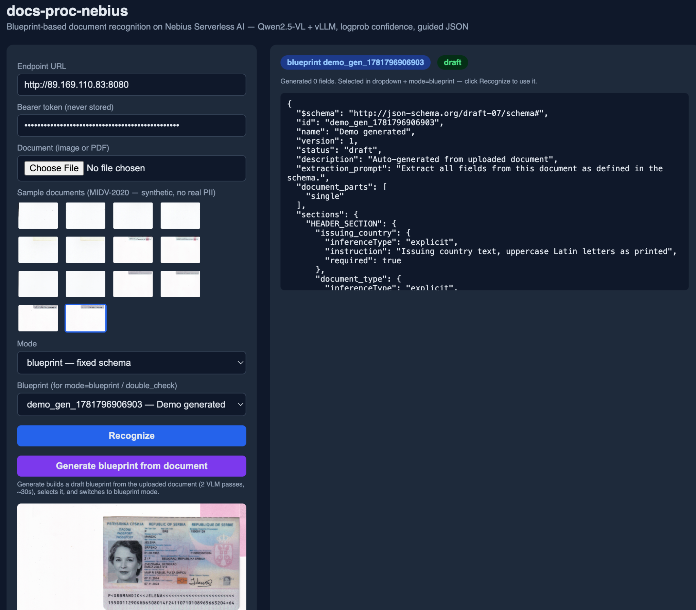

# Serverless Document Recognition on Nebius: KYC for a Legal Copilot

*#NebiusServerlessChallenge*

---

Legal teams run on documents. Before a lawyer can act for a client, that client's identity has to be verified — passports, national ID cards, residence permits arrive as phone photos, flatbed scans, and re-scanned copies of copies, in wildly varying quality. Someone (or something) has to read the structured fields off them, decide how much to trust each value, and hand the result to the rest of the system. Get it wrong silently and you've onboarded the wrong person; ask a human to re-key every field and you've thrown away the automation.

For the Nebius Serverless AI Builders Challenge we built **docs-proc-nebius**: the document-recognition component for a legal Copilot. It extracts structured fields from identity documents, attaches a *calibrated confidence score to every field*, enforces output structure with guided JSON decoding, and runs as a single Nebius Serverless GPU Endpoint. This post is in two parts: first the **functional story** — the problem, the build-vs-buy decision, and what the component actually does — and then a **technical deep dive** for readers who want the implementation.

> **TL;DR** — A FastAPI + vLLM service running `Qwen2.5-VL-7B-Instruct` on one Nebius H100 SXM turns an ID photo into schema-validated JSON with a confidence score on every field. Live inference runs on a Serverless **Endpoint**; the 60-document evaluation runs from the *same* Docker image as a portable, env-driven container, ready to drop into Nebius Serverless Jobs (the next step). ~1.84 s/doc (p50), ~$0.001/doc marginal, 100% on `document_number`. The interesting parts: how we got log-probabilities to behave as a confidence signal, and the three ways the Nebius deploy failed before it worked.

---

# Part 1 — The Functional Story

## The problem, honestly scoped

The target system is a legal Copilot that operates across the US, Europe and parts of Asia. That footprint makes data residency a first-class architectural constraint, not an afterthought — GDPR and the EU AI Act, among others, shape *where* client data may be processed. The Copilot ingests many document types; the slice this submission covers is the one that gates everything else: **identity-document recognition for client onboarding (KYC)**.

Real client documents obviously can't appear in a public repo or a live demo. So everything here is built and measured on **MIDV-2020**, a public synthetic dataset of 1,000 identity documents across 10 types, with polygon annotations for every text field. That keeps the submission fully reproducible — anyone can download the data and run the exact pipeline — while the architecture is identical to the one that runs against real documents in private.

The functional requirement is narrow and strict: accept a document image, determine its type and how confidently it matches that type, extract the predefined fields for that type, and return JSON — with a trust score the calling system can route on. Two entry points are needed: a machine **API** for the Copilot, and a **web UI** for testing and demos.

## Build vs. buy: why serverless

There were three honest options for the recognition component:

1. **Run our own always-on GPU server.** Full control, but we'd pay for an H100 around the clock to serve a workload that bursts during business hours and idles overnight — and we'd own the ops.
2. **Call an external OCR/IDV SaaS.** Fast to start, but it sends client documents to a third party we don't control the region of — a non-starter when data residency is the whole point — and the per-call price doesn't bend to our volume profile.
3. **A serverless GPU endpoint.** Billed per second *while it's running*, and nothing while it's stopped — so we can shut it down off-hours instead of committing to a 24/7 reserved H100 — no servers to patch, and, crucially, we **pin the component to a chosen region** (we run `eu-north1`), exactly the data-residency control GDPR-style rules demand.

We chose serverless on the intersection of **cost, security, and data residency**. The cost case is concrete: this workload bursts during business hours and idles overnight, so per-second billing plus the ability to **stop the endpoint when no documents are arriving** beats paying for a reserved GPU around the clock. To be precise: while the endpoint is up you *do* pay for warm-up and idle seconds — the saving comes from stopping it between bursts, not from per-request magic. The residency case is structural: a regional serverless endpoint keeps processing inside one jurisdiction without us operating that jurisdiction's hardware.

## Choosing the model: the smallest one that works

Model choice followed the same discipline as the platform — pick the *simplest* model that clears the bar, not the biggest one available. Before committing we benchmarked several open vision-language models on hosted inference (through other platforms) against our document set, and the **Qwen2.5-VL** family came out ahead on field-extraction accuracy. The tempting "more is better" option, **`Qwen2.5-VL-72B-Instruct`**, turned out to be overkill: it doesn't fit a single H100, needs multi-GPU sharding, and answers slower per request — and on this recognition task it didn't buy enough accuracy over the 7B to justify the extra cost and latency. So we deploy **`Qwen2.5-VL-7B-Instruct`**: it fits comfortably on one H100 SXM, already hits 100% on `document_number`, and lets the per-field confidence and guided-JSON machinery (Part 2) carry the rest. Bigger model, bigger bill, slower answers — no better outcome for this workload.

## What the component does

A caller submits a document in one of two ways: a base64-encoded image in the request body, or an object in an S3 bucket — either **Nebius Object Storage (NOS)** or any external S3-compatible store, fetched via a presigned URL. The service then:

1. **Classifies** the document and scores how well it matches a known type.
2. **Selects a blueprint** — a declarative schema for that document type — based on the type and confidence.
3. **Recognizes** the fields defined in that blueprint.
4. **Returns JSON** with per-field values, per-field confidence, and a routing decision.

There's a fifth capability that sits alongside recognition rather than inside the pipeline: the component can **generate a blueprint from a source document**. Point it at a sample image and it drafts the schema — fields, instructions, format hints — which the user (or calling system) can then **edit, save, and reuse**. That's what makes the system extensible: a new document type doesn't need a code change, it needs a generated-and-tweaked blueprint.

A **blueprint** is the core abstraction behind all of this: a JSON document describing which fields to extract from a given document type, with per-field instructions and hints (is this value printed verbatim, or inferred and normalized?). Blueprints aren't hardcoded — generate, tweak, save, and they're live for recognition with no redeploy.

For human use, the same service ships a **web demo**: drag in an image or PDF, see the document render, click "recognize," and watch the fields come back with confidence bars. It's the same code path as the API, just driven from a browser.

Finally, the routing decision turns raw scores into an action. Every response maps to a confidence band: high-confidence extractions are auto-approved, mid-confidence ones are queued for review, and low-confidence ones escalate to a human operator. That's what lets a downstream onboarding flow make straight-through / review / escalate decisions without inspecting individual field scores.

---

# Part 2 — The Technical Deep Dive

## The stack

We kept the moving parts minimal. FastAPI (run by uvicorn) owns HTTP routing, auth, NOS integration and the demo UI; vLLM serves `Qwen2.5-VL-7B-Instruct`, a vision-language model that takes an image plus a prompt and returns structured JSON. The one design choice worth flagging — because it turned out to be load-bearing for *deploying* on Nebius — is that uvicorn runs as PID 1 on port 8080 and vLLM warms up *behind* it in the background. The Nebius endpoint ingress terminates TLS and handles public routing, so there's no in-container reverse proxy to manage. Everything is configured through environment variables, and the same image runs CPU-only with `MOCK_VLLM=1` for laptop development — the property that later lets the batch evaluation reuse the endpoint's code verbatim.

Zooming one level further into the API Service, the components split cleanly by responsibility — an auth guard, the API router, the document extractor that talks to vLLM, the blueprint store, a confidence router, a PDF converter, and an NOS writer:

## Guided JSON decoding

Free-form generation from a VLM occasionally emits malformed JSON — a missing quote, a trailing comma, a hallucinated field name. The fix is **guided JSON decoding**: before each extraction call, the service converts the blueprint's field schema into a JSON Schema object and passes it to vLLM as `guided_json`. vLLM constrains decoding so the output *must* conform — no regex post-processing. If a backend can't do guided decoding, the service logs a `guided_json_fallback` event and retries without the constraint.

## Per-field confidence from log-probabilities

Most recognition systems report one document-level confidence number, which is too coarse to route on. An extraction might be 100% sure of `document_number` but shaky on a handwritten `place_of_birth`. So the service computes **per-field confidence** from vLLM's token log-probabilities:

1. Request `logprobs=true` alongside the generation.
2. For each extracted value, locate the token span that encodes it.
3. `confidence = round(100 × exp(mean(logprob)))` over that span.
4. Fall back to the whole-response mean if span mapping fails.

Step 2 hides a sharp edge that cost us a debugging session. vLLM returns **GPT-2 byte-level BPE tokens**, where a leading space is `Ġ` and a newline is `Ċ`. Matching the value's characters directly against those raw tokens *fails for any value containing whitespace* — so multi-word names and addresses silently fell through to the coarse `response_mean` fallback. Decoding the byte-level tokens back to real characters before matching fixed it: on a sample document, the fields reporting true `logprobs` confidence went from 5 to 11 out of 12 (equivalently, coarse `response_mean` fallbacks dropped from 7 to 1). The lesson: when you consume a model's logprobs, you're consuming its *tokenizer's* worldview, not yours.

On an earlier evaluation run (measured before the byte-decode fix above), mean confidence on correct extractions was **98.2** vs **92.7** on incorrect ones — a 5.5 pp calibration gap. The model is slightly overconfident on its errors (expected at 7B), but the signal is directionally right and good enough for triage routing.

## One image now, Serverless Jobs next

"Serverless AI" on Nebius is two products — a **Serverless Endpoint** for live inference and **Serverless Jobs** for batch work. This submission runs on the **Endpoint** (the live `/recognize` API). The MIDV-2020 evaluation is a separate harness (`nebius-job/`) that calls the live endpoint over 60 documents — and it's deliberately built to graduate to a Serverless Job: it's the **same Docker image and code path** as the endpoint (no second artifact to build or version), it's entirely **env-driven** (manifest, endpoint URL, S3 credentials all injected), and it writes per-document results plus a summary report to NOS (`eval/reports/<job_id>.json`), so a run is checkpointed and inspectable rather than fire-and-forget, with idempotent re-runs against the same manifest. Today it runs as a container against the endpoint; **wiring it into Nebius Serverless Jobs is the next step on the roadmap** — the artifact is already shaped for it.

## Deploying to Nebius: three failures before it worked

The honest part. The endpoint did not come up on the first try — or the second, or the third — and each failure taught something specific about Serverless Endpoints:

1. **`--parent-id` must own `--subnet-id`.** Our first deploys hung in provisioning forever with *no logs*. The cause: the project we passed as `--parent-id` didn't own the subnet we attached. Match them and it provisions cleanly. Silent hangs are the worst failure mode, so this one hurt.
2. **Don't pass `--ssh-key`.** It returns `rpc NotFound`, which fails the create operation with `code=13` and leaves the endpoint stuck in `STARTING`. The key isn't injected anyway (you can't SSH into the endpoint VM), so the flag is pure downside. Removed it.
3. **Start order decides readiness.** Originally the container waited on vLLM (up to 900 s of model load) *before* opening port 8080. Nebius' readiness probe never saw an open port, so it never marked the endpoint healthy and no logs streamed. Flipping it — uvicorn on 8080 *first* as PID 1, vLLM warming in the background — opens the port in seconds, readiness passes, and the model finishes loading while `/health` honestly reports "not ready yet."

None of these are in the docs in one place; all three are the kind of thing you only learn by deploying.

## Evaluating on MIDV-2020

We ran 60 documents across three types — Spanish national ID, Greek passport, Serbian passport — through the live endpoint with `mode=blueprint`. `document_number` came back at 100%; `surname` at 65%; the dates lagged at 33%. The dates were a red herring: MIDV stores them as `DD.MM.YYYY` and the model emits `YYYY-MM-DD`. The right fix was to **normalize at the metric layer, not the prompt** — normalizing both sides to `YYYYMMDD` took dates from 0% to 33% without touching the prompt. Greek-script fields dragged the Greek passport down to 25%, because a 7B model approximates polytonic Greek rather than transcribing it exactly — a known model-size limitation, not a pipeline bug.

## Performance and cost

On a single H100 SXM, those 60 documents ran at **~1.84 s/doc (p50)**, **2.34 s/doc (p95)**, 124 s total. At the H100 SXM rate that's a **marginal ~$0.001/document** during the batch (~$1 projected per 1,000 docs) — the compute spent actually processing, not counting warm-up or idle time the endpoint is up. The real cost lever is operational: because you're billed per second the endpoint *runs* and nothing while it's *stopped*, the bursty business-hours profile of a KYC workload lets you stop the endpoint off-hours instead of paying for a reserved H100 around the clock — the whole reason serverless won the build-vs-buy decision in Part 1.

## What we learned

**Conservative prompts beat precise ones at 7B.** Adding "STRICTLY return YYYY-MM-DD or null" made the model return null whenever it was unsure (date_of_issue fell 55%→37%); "use Latin script only" made it prefer MRZ surnames over printed ones (65%→50%). More instruction means more constraint means more ways to go wrong.

**Normalize in your evaluation code, not your prompt.** Format variation is the metric layer's job. The model already knows the date — it just formats it its own consistent way.

**Logprobs are a practical confidence signal even at 7B** — once you decode the tokenizer's bytes. The calibration gap is small but real, and that's enough for an auto-approve / review / escalate router.

## Hardening it for production

A happy-path demo isn't a serious component. The service ships structured JSON logging, a Prometheus `/metrics` endpoint, and a `/health` probe that actively checks vLLM so readiness is truthful. Secrets load by reference from **Nebius Mysterybox** (no plaintext in the deploy spec); a body-size limit returns HTTP 413 and a per-request deadline returns HTTP 504 as DoS guards; presigned-URL fetches are restricted by an SSRF allowlist; and `start.sh` supervises vLLM in a restart-on-crash loop while uvicorn stays PID 1 so the port — and `/health` — survive a backend blip. The full pillar-by-pillar rationale (including the Well-Architected review) is in [WELL-ARCHITECTED.md](WELL-ARCHITECTED.md).

## Roadmap: from this submission to a production MVP

This submission is a working, honest slice. The path to a production MVP is mapped, and most of it leans further into the Nebius platform:

- **Fine-tuning & continued pretraining** — adapt the base VLM on a synthetic + publicly available document corpus to lift recognition quality (especially the weak spots: dates and non-Latin scripts) and cut latency with a tighter, task-specialized model.
- **Batch recognition as a Serverless Job** — graduate the eval harness into a first-class **Nebius Serverless Job** for high-throughput, scheduled batch recognition (the artifact is already shaped for it — same image, env-driven).
- **Failover via Nebius Token Factory** — fall back to a managed model endpoint when the self-hosted endpoint is unavailable, so recognition degrades gracefully instead of failing.
- **Queues & autoscaling** — put a queue in front of recognition and autoscale replicas to absorb large volumes and traffic spikes without dropping requests.
- **Encryption at rest** — server-side encryption for documents and results in NOS (today only in-transit is enforced), completing the GDPR / data-residency story.
- **Multi-region deployment** — pin endpoints per jurisdiction (US / EU / Asia) to satisfy data-residency rules beyond the single `eu-north1` region we run today.
- **Human-in-the-loop validation** — wire the `review` / `escalate` routing bands into a reviewer workflow (e.g. Nebius Human Validation) so low-confidence fields get corrected — and feed those corrections back into fine-tuning, closing the loop.
- **Quantization & observability** — FP8/AWQ quantization to trim latency and cost, plus dashboards and alerting on the existing Prometheus metrics via Nebius Managed Prometheus.

## Try it

The full source, blueprints, eval scripts and smoke tests are on GitHub: [docs-proc-nebius](https://github.com/dsadchikov/docs-proc-nebius). To run locally in mock mode with no GPU: `docker compose -f docker-compose.cpu.yml up --build`. The [Proof of Execution](https://github.com/dsadchikov/docs-proc-nebius#proof-of-execution) section links the live endpoint, sample recognition results, and the eval report.

<!-- TODO before publishing: add a 3–10 min video walkthrough link. -->

---

*Built for the Nebius Serverless AI Builders Challenge (June 2026). #NebiusServerlessChallenge*
