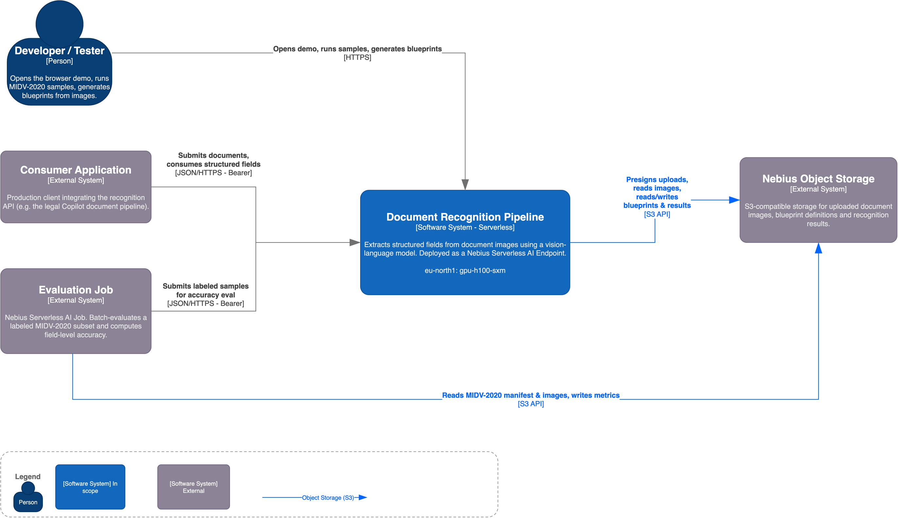
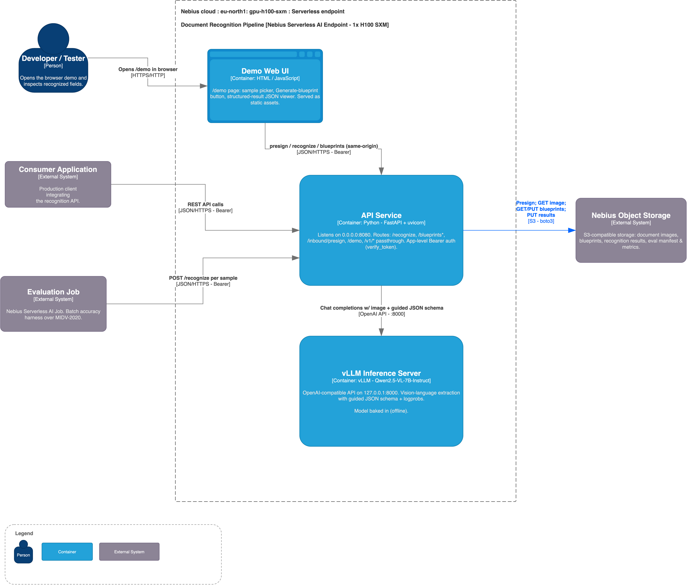
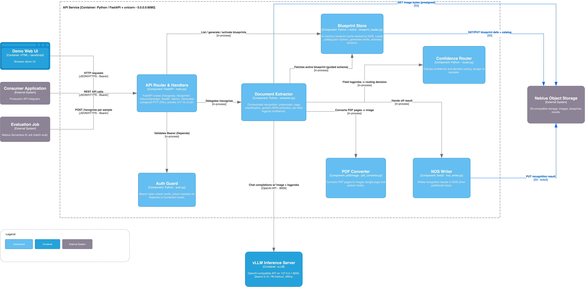

# docs-proc-nebius

**Serverless document-recognition service** built for the [Nebius Serverless AI Builders Challenge](https://nebius.com/blog/posts/ai-builders-challenge).

📹 **Video walkthrough:** <!-- TODO: add public 3–10 min video link before submission -->
🔎 **Proof of execution:** see [Proof of Execution](#proof-of-execution) (live endpoint URL, sample results, eval report).

Runs on a Nebius GPU endpoint (H100 SXM) with [Qwen2.5-VL-7B-Instruct](https://huggingface.co/Qwen/Qwen2.5-VL-7B-Instruct) via vLLM. Extracts structured fields from identity documents, with per-field confidence from vLLM logprobs, JSON schema enforcement (guided decoding), multi-page PDF support, and a browser-based demo UI — all behind a FastAPI (uvicorn) app with NOS-backed blueprints.

---

## Architecture

```
Client
  │ HTTPS
  ▼
Nebius endpoint ingress (TLS termination, public routing)
  │
  ▼
FastAPI app (uvicorn, :8080)  ──────────────────────────────────────────
  │  /recognize                         │  /blueprints/*
  │                                     │
  ▼                                     ▼
extractor.py                      blueprint_loader.py
  ├── extract_document()            ├── BlueprintStore (in-memory)
  ├── extract_auto()                ├── loads local /app/blueprints/
  └── extract_packet()              └── pulls updates from NOS on /reload
        │
        ▼
   vLLM server (Qwen2.5-VL-7B-Instruct)
   – guided_json decoding
   – logprobs for per-field confidence
```

<!-- images/ is gitignored; commit diagrams with: git add -f images/architecture-context.png images/architecture-containers.png images/architecture-components.png -->




**Deployment target:** Nebius Serverless GPU Endpoint (1× H100 SXM, 16 vCPU, 200 GB RAM).  
**Standalone mode:** Same image runs CPU-only with `MOCK_VLLM=1` for integration tests.

---

## Features

| Feature | Detail |
|---|---|
| **5 recognition modes** | `blueprint`, `auto`, `raw`, `double_check`, `packet` |
| **Multi-page packets** | `mode=packet` — classify each page, group consecutive same-type pages, extract per logical document |
| **Logprob confidence** | Per-field `confidence` (0–100) derived from vLLM token log-probabilities; `confidence_source: "logprobs"` |
| **Guided JSON** | `blueprint_to_guided_schema` → `guided_json` param on vLLM call; retry without guided on backend error |
| **Blueprint CRUD** | Create / update / delete blueprints at runtime; hot-reload from NOS with `POST /blueprints/reload` |
| **Blueprint generation** | Two-pass VLM workflow: infer fields from a sample image, return a draft blueprint |
| **NOS integration** | Presigned PUT upload (`GET /inbound/presign`), outbound results written to NOS |
| **Demo UI** | `GET /demo` — vanilla JS, confidence bars, bounding-box canvas overlay, one-click MIDV samples |
| **Property tests** | Hypothesis-based tests (P11–P14) cover logprob math, guided schema, grouping, metric bounds |

---

## Quick Start — Nebius GPU Endpoint

### 1. Prerequisites

- [Nebius CLI](https://docs.nebius.com/cli/) configured (`nebius iam whoami` works)
- Docker registry in your Nebius project

### 2. Provision storage and credentials

Create a Nebius Object Storage (NOS) bucket for blueprints and a static S3 key the
endpoint uses to read/write it:

```bash
# Create the NOS bucket (one-time)
nebius storage bucket create \
  --name <YOUR_NOS_BUCKET> \
  --parent-id <PROJECT_ID>

# Issue a static S3 access key for a service account
# (scripts/setup-iam.sh provisions a least-privilege SA scoped to this bucket)
nebius iam service-account static-key create \
  --service-account-id <SA_ID> \
  --format json
```

The command prints `S3_ACCESS_KEY` / `S3_SECRET_KEY` — store them in Nebius Mysterybox
(see `scripts/setup-iam.sh`) and pass them to the endpoint in step 5. The bucket region
is `eu-north1` (S3 endpoint `https://storage.eu-north1.nebius.cloud`).

### 3. Build and push

```bash
# On a Linux build machine with Docker (use your image tag, e.g. v30 — the current build)
docker build -f nebius-endpoint/Dockerfile -t cr.eu-north1.nebius.cloud/<REGISTRY_ID>/endpoint:<TAG> nebius-endpoint/
docker push cr.eu-north1.nebius.cloud/<REGISTRY_ID>/endpoint:<TAG>
```

### 4. Upload blueprints to NOS

```bash
# Upload built-in blueprints so the endpoint can pull them
for bp in nebius-endpoint/blueprints/*/v1.json; do
  type=$(basename $(dirname $bp))
  aws s3 cp "$bp" \
    "s3://<YOUR_NOS_BUCKET>/blueprints/${type}/v1.json" \
    --endpoint-url https://storage.eu-north1.nebius.cloud
done
```

### 5. Deploy endpoint

```bash
nebius ai endpoint create \
  --name doc-recognition \
  --image cr.eu-north1.nebius.cloud/<REGISTRY_ID>/endpoint:<TAG> \
  --container-port 8080 \
  --platform gpu-h100-sxm \
  --preset 1gpu-16vcpu-200gb \
  --disk-size 80Gi \
  --shm-size 16Gi \
  --subnet-id <SUBNET_ID> \
  --public \
  --auth none \
  --env AUTH_TOKEN=<YOUR_AUTH_TOKEN> \
  --env S3_ACCESS_KEY=<S3_ACCESS_KEY> \
  --env S3_SECRET_KEY=<S3_SECRET_KEY> \
  --env S3_BUCKET=<YOUR_NOS_BUCKET> \
  --env S3_REGION=eu-north1 \
  --env S3_ENDPOINT=https://storage.eu-north1.nebius.cloud \
  --parent-id <PROJECT_ID>
```

> **Tip:** `scripts/deploy-endpoint.sh <tag>` wraps this command and loads secrets by reference from Nebius Mysterybox (`--env-secret`) instead of plaintext `--env`. Run it on the build VM.

The command prints an `endpoint_id`. The Bearer token for requests is the `AUTH_TOKEN` you set above (enforced at the app layer by `verify_token`).

> **Why `--auth none` + `AUTH_TOKEN`?** Nebius `--auth token` puts an ingress that requires a Bearer on *every* path, which blocks the browser demo (`GET /demo` and CORS preflight both 401). Deploying with `--auth none` keeps the ingress open so `/demo`, `/static`, and `/health` load in the browser, while the app's own `AUTH_TOKEN` protects `/recognize` and the blueprint APIs.

### 6. Smoke test

```bash
export NEBIUS_ENDPOINT_URL="http://<PUBLIC_IP>:8080"
export NEBIUS_ENDPOINT_TOKEN="<TOKEN>"
export NEBIUS_ENDPOINT_ID="<ENDPOINT_ID>"
bash nebius-endpoint/smoke_test.sh
```

All 35 tests should pass. Expected output ends with `35 passed  0 failed`.

---

## Local Development (CPU / mock mode)

```bash
cd nebius-endpoint

# Copy and fill in the template
cp ../.env.example .env
# Edit .env: set AUTH_TOKEN, optionally S3_* for NOS features

docker compose -f docker-compose.cpu.yml up --build
```

The app listens on `http://localhost:8080`. `MOCK_VLLM=1` returns deterministic fixtures — no GPU needed.

Run tests:

```bash
pip install -r requirements.txt pytest hypothesis httpx
pytest tests/ -q
```

---

## API Reference

All endpoints except `/health`, `/demo`, `/static`, and `/metrics` require `Authorization: Bearer <token>` (enforced at the app layer whenever `AUTH_TOKEN` is set).

A `GET /metrics` endpoint exposes Prometheus text exposition (request counts, latency, vLLM-up) for Nebius Managed Prometheus; disable with `METRICS_ENABLED=0`.

### POST /recognize

Extract fields from a document.

**Request body:**

```json
{
  "document": {
    "type": "base64",
    "value": "<base64-encoded image or PDF>",
    "mime_type": "image/jpeg"
  },
  "mode": "blueprint",
  "blueprint_id": "passport",
  "options": {
    "include_confidence": true,
    "confidence_mode": "both"
  }
}
```

`document.type` options:
- `base64` — inline base64 content
- `presigned_url` — URL returned by `GET /inbound/presign`
- `nebius_object` — NOS object key (requires S3 env vars)

`mode` options:
- `blueprint` — extract fields defined in a blueprint; requires `blueprint_id`
- `auto` — classify document type, pick best blueprint, extract
- `raw` — return raw VLM text with no structured parsing
- `double_check` — extract twice, cross-validate, lower confidence on disagreements
- `packet` — multi-page PDF: classify pages, group by type, extract per logical document

**Response (blueprint / auto / double_check):**

```json
{
  "request_id": "3fa85f64-5717-4562-b3fc-2c963f66afa6",
  "mode": "blueprint",
  "blueprint_id": "passport",
  "document_confidence": 94,
  "routing": "auto_classified",
  "fields": {
    "document_number": {
      "value": "AB123456",
      "confidence": 99,
      "confidence_source": "logprobs"
    },
    "surname": {
      "value": "MARTINEZ",
      "confidence": 97,
      "confidence_source": "logprobs"
    },
    "date_of_birth": {
      "value": "1990-01-20",
      "confidence": 88,
      "confidence_source": "logprobs"
    }
  }
}
```

`routing` bands: `auto_classified` (85–100), `review_required` (50–84), `escalate_to_operator` (0–49). The three bands are exhaustive and mutually exclusive.

**Response (packet mode):**

```json
{
  "request_id": "...",
  "mode": "packet",
  "documents": [
    {
      "pages": [1, 2],
      "blueprint_id": "passport",
      "document_confidence": 91,
      "routing": "auto_classified",
      "fields": { ... }
    },
    {
      "pages": [3],
      "blueprint_id": "id_card",
      "document_confidence": 72,
      "routing": "review_required",
      "fields": { ... }
    }
  ]
}
```

### GET /inbound/presign?filename=photo.jpg

Returns a presigned PUT URL for direct client-to-NOS upload (expires in 300 s).

```json
{
  "presigned_put_url": "https://storage.eu-north1.nebius.cloud/...",
  "nos_key": "inbound/2026/06/12/14/35/a1b2c3d4e5f6.jpg",
  "expires_in": 300
}
```

After upload, pass `{"type": "nebius_object", "value": "<nos_key>"}` in `/recognize`.

### Blueprint endpoints

| Method | Path | Description |
|---|---|---|
| `GET` | `/blueprints` | List all loaded blueprints |
| `GET` | `/blueprints/{id}` | Get raw blueprint JSON |
| `POST` | `/blueprints` | Create blueprint (body: BlueprintCreate) |
| `PUT` | `/blueprints/{id}` | Update blueprint fields |
| `DELETE` | `/blueprints/{id}` | Delete blueprint |
| `POST` | `/blueprints/generate` | Generate draft blueprint from sample image |
| `POST` | `/blueprints/reload` | Reload blueprints from NOS (hot-reload, no restart) |

### GET /health

```json
{
  "status": "healthy",
  "vllm": "up",
  "fastapi": "up",
  "gpu_enabled": true,
  "mock_mode": false,
  "model": "Qwen2.5-VL-7B-Instruct",
  "uptime_seconds": 3600.1,
  "blueprints_loaded": 4
}
```

### GET /demo

Opens the browser demo UI. No auth required.

<!-- TODO: capture a real /demo screenshot/GIF before submission. /images/ is gitignored,
     so commit with: git add -f images/demo-screenshot.png -->


---

## Blueprint Format

Blueprints are JSON files stored under `nebius-endpoint/blueprints/<id>/v1.json` and synced to NOS.

```json
{
  "$schema": "http://json-schema.org/draft-07/schema#",
  "id": "passport",
  "name": "Passport (international)",
  "version": 1,
  "status": "active",
  "description": "International travel passport — biographical data page.",
  "extraction_prompt": "Extract all personal identification and travel document fields from this passport image. Return JSON with all fields including MRZ lines if visible.",
  "document_parts": ["single"],
  "sections": {
    "DOCUMENT_METADATA": {
      "document_number": {
        "inferenceType": "explicit",
        "instruction": "Passport number exactly as printed on the document",
        "required": true
      }
    },
    "PERSONAL_INFO": {
      "surname": {
        "inferenceType": "explicit",
        "instruction": "Surname / last name in uppercase as printed on the document",
        "required": true
      },
      "date_of_birth": {
        "inferenceType": "inferred",
        "instruction": "Date of birth converted to YYYY-MM-DD format from any printed date format",
        "required": true
      }
    }
  }
}
```

Built-in blueprints: `passport`, `id_card`, `residence_permit_ltu_front`, `default`.

---

## MIDV-2020 Evaluation

The eval job measures field-level accuracy on the public [MIDV-2020](https://smartengines.com/midv-2020/) synthetic dataset (60 documents, 3 document types).

### Results (Qwen2.5-VL-7B-Instruct, v30, H100 SXM)

**Per-field accuracy (exact match after normalization):**

| Field | Accuracy |
|---|---|
| document_number | 100% |
| nationality | 67% |
| sex | 67% |
| surname | 65% |
| date_of_issue | 55% |
| given_names | 53% |
| personal_number | 45% |
| date_of_birth | 33% |
| date_of_expiry | 33% |

**Per-document-type accuracy:**

| Document type | Accuracy |
|---|---|
| `srb_passport` | 77% |
| `esp_id` | 68% |
| `grc_passport` | 25%* |

\* Greek-script fields (Σ, Α, Ν...) are rendered correctly in MRZ but the model transcribes the Cyrillic/Latin approximation rather than the exact Unicode string — a known VLM limitation for polytonic Greek.

**Confidence calibration** (measured on the pre-fix v29 eval job; the v30 logprob
byte-decode fix changes which fields report `logprobs` vs `response_mean`, so these
figures should be re-measured against v30 when the eval artifacts are captured):
- Mean confidence on correct extractions: **98.2**
- Mean confidence on incorrect extractions: **92.7**
- Calibration gap: **5.5 pp** (model is slightly overconfident on errors — expected for a 7B VLM)

### Running the eval job yourself

```bash
# 1. Prepare MIDV-2020 subset and upload to NOS
bash nebius-job/scripts/prepare_midv2020.sh \
  --types "esp_id,grc_passport,srb_passport" \
  --count 20 \
  S3_BUCKET=<YOUR_NOS_BUCKET> \
  S3_ACCESS_KEY=<KEY> \
  S3_SECRET_KEY=<SECRET>

# 2. Run the evaluation job
docker run --rm \
  -e ENDPOINT_URL=http://<PUBLIC_IP>:8080 \
  -e ENDPOINT_TOKEN=<TOKEN> \
  -e S3_BUCKET=<YOUR_NOS_BUCKET> \
  -e S3_ACCESS_KEY=<KEY> \
  -e S3_SECRET_KEY=<SECRET> \
  -e MANIFEST_PATH=s3://<YOUR_NOS_BUCKET>/eval/midv2020/manifest.json \
  -e OUTPUT_PATH=s3://<YOUR_NOS_BUCKET>/eval/ \
  nebius-job:latest
```

Results are written to `eval/results/<job_id>/` in NOS and a summary report to `eval/reports/<job_id>.json`.

The eval harness (`nebius-job/`) reuses the **same Docker image and code path** as the
endpoint and is fully env-driven, so it's shaped to run as a **Nebius Serverless Job**. Today
it runs as a container against the live endpoint; packaging it as a Serverless Job is the next
step on the roadmap. This submission's Serverless product in production is the **Endpoint**
(live `/recognize`).

---

## Proof of Execution

Captured artifacts from a live run, for judges to verify the service end-to-end:

- **Live endpoint / demo:** `<TODO: public endpoint URL>` → `/demo` <!-- TODO: endpoints are deleted between sessions to save cost (see CLAUDE.md); redeploy via INTERNAL-RUNBOOK.md and paste the fresh URL + judge Bearer token note right before submission -->
- **Sample recognition results** (≥2 distinct document types, captured live against `v31` on 2026-06-18):
  - `samples/recognize_srb_passport.json` — `mode=auto`
  - `samples/recognize_esp_id.json` — `mode=auto`
  - `samples/recognize_srb_passport_blueprint.json` — `mode=blueprint` (matches eval job methodology; full field set incl. MRZ)
  - `samples/recognize_esp_id_blueprint.json` — `mode=blueprint` (matches eval job methodology; full field set incl. MRZ)
- **Evaluation summary report:** `samples/eval_report.json` <!-- TODO: copy eval/reports/<job_id>.json from a live eval run before submission; S3 read access to eval/reports/ needs verifying — denied with current local creds as of 2026-06-18 -->

See [`samples/README.md`](samples/README.md) for the exact capture commands and a note on why
both `auto` and `blueprint` variants are included.

---

## Cost and Latency

Measured on a single H100 SXM endpoint, 60 documents, `mode=blueprint`:

| Metric | Value |
|---|---|
| Latency p50 | 1.84 s/doc |
| Latency p95 | 2.34 s/doc |
| Total for 60 docs | 124 s |
| GPU cost (H100 SXM @ $2.80/hr) | ~$0.001/doc (marginal, during batch) |
| **1 000 docs (projected)** | **~$1.00** (marginal compute only) |

The ~$0.001/doc is the **marginal** processing cost during the batch — it does not include
warm-up or the idle seconds while the endpoint is up. Nebius Serverless GPU Endpoints are
billed per second **while running**, with **no charge while stopped** — so the real saving for
a bursty workload comes from stopping the endpoint between bursts, not from per-request billing.

---

## Environment Variables

Copy `.env.example` and fill in your values:

```bash
cp .env.example .env
```

| Variable | Required | Description |
|---|---|---|
| `AUTH_TOKEN` | Yes | Bearer token for `/recognize` and blueprint APIs |
| `S3_BUCKET` | Yes | Nebius Object Storage bucket name |
| `S3_ACCESS_KEY` | Yes | NOS static access key ID |
| `S3_SECRET_KEY` | Yes | NOS static access key secret |
| `S3_ENDPOINT` | No | NOS endpoint URL (default: `https://storage.eu-north1.nebius.cloud`) |
| `S3_REGION` | No | NOS region (default: `eu-north1`) |
| `VLLM_BASE_URL` | No | vLLM server URL (default: `http://127.0.0.1:8000`) |
| `VLLM_MODEL_NAME` | No | Model name (default: `Qwen2.5-VL-7B-Instruct`) |
| `GPU_ENABLED` | No | `1` for GPU mode, `0` for CPU (default: `1`) |
| `MOCK_VLLM` | No | `1` to use deterministic fixtures instead of real vLLM (default: `0`) |
| `PDF_DPI` | No | DPI for PDF→image conversion (default: `200`) |
| `PDF_MAX_PAGES` | No | Max pages per PDF (single-page and packet); over → 422 (default: `50`) |
| `REQUEST_TIMEOUT` | No | Per-request deadline in seconds; over → 504 (default: `30`) |
| `PACKET_TIMEOUT` | No | Deadline for multi-page packet requests (default: `180`) |
| `MAX_UPLOAD_BYTES` | No | Max request body in bytes; over → 413 (default: `26214400` = 25 MiB) |
| `CORS_ALLOW_ORIGINS` | No | Comma-separated allowed origins; empty = same-origin only (default: empty) |
| `FETCH_URL_ALLOWLIST` | No | Comma-separated hosts allowed for `presigned_url`; empty → NOS host |
| `METRICS_ENABLED` | No | Expose `GET /metrics` Prometheus exposition (default: `1`) |

---

## Project Structure

```
nebius-endpoint/
├── app/
│   ├── main.py              # FastAPI app, routes, lifespan
│   ├── extractor.py         # VLM calls, logprob confidence, guided JSON
│   ├── blueprint_loader.py  # BlueprintStore: load / CRUD / reload from NOS
│   ├── models.py            # Pydantic models: RecognizeRequest/Response, etc.
│   ├── config.py            # Config from env vars
│   ├── pdf_converter.py     # PDF → image pages (poppler)
│   ├── nos_writer.py        # Write outbound results to NOS
│   ├── mock_vllm.py         # Deterministic fixtures for tests
│   ├── auth.py              # Bearer token verification
│   └── static/
│       └── demo.html        # Browser demo UI
├── blueprints/
│   ├── _catalog.json
│   ├── passport/v1.json
│   ├── id_card/v1.json
│   ├── residence_permit_ltu_front/v1.json
│   └── default/v1.json
├── tests/                   # pytest + Hypothesis property tests
├── Dockerfile               # GPU endpoint image
├── Dockerfile.cpu           # CPU / local dev image
├── docker-compose.cpu.yml   # Local dev compose
├── start.sh                 # uvicorn (PID 1, :8080) + vLLM in background
└── smoke_test.sh            # 35-test end-to-end smoke suite

nebius-job/
├── job.py                   # MIDV-2020 evaluation harness (calls the Endpoint)
├── eval_metrics.py          # exact_match, levenshtein_sim, calibration, summarize
├── scripts/
│   ├── prepare_midv2020.sh  # Download MIDV-2020 subset, upload to NOS
│   └── build_midv_manifest.py  # Parse VIA 2.x annotations → manifest.json
└── tests/                   # pytest + Hypothesis tests for metrics
```

---

## License

MIT — see [LICENSE](LICENSE).

See [WELL-ARCHITECTED.md](WELL-ARCHITECTED.md) for a pillar-by-pillar review of the design mapped to Nebius infrastructure.

Built with [Nebius AI](https://nebius.com) for the Nebius Serverless AI Builders Challenge.  
`#NebiusServerlessChallenge`
