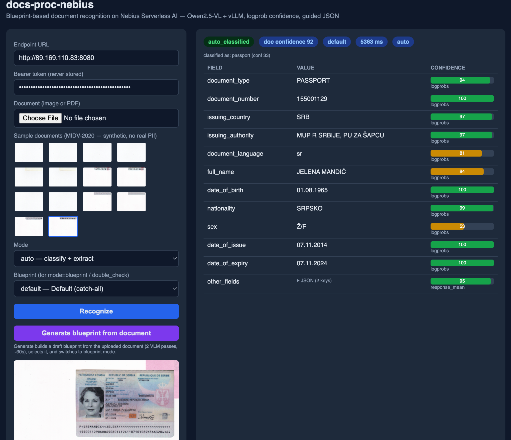
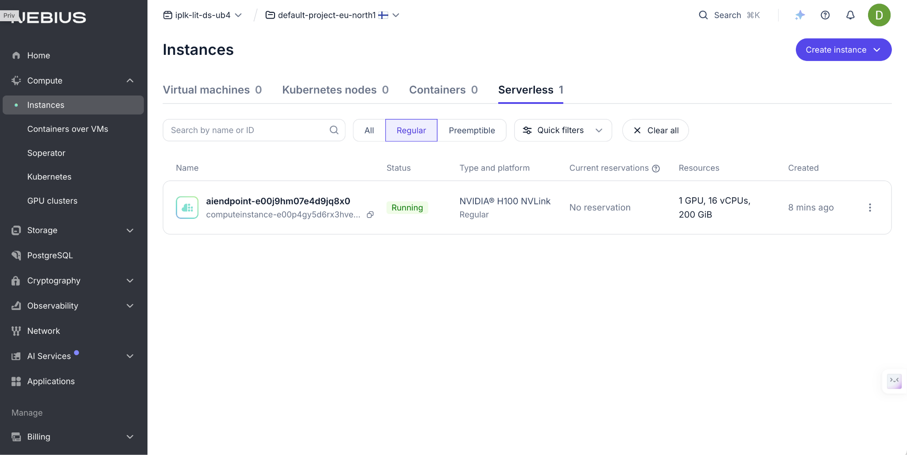

# docs-proc-nebius

**Serverless document-recognition service** built for the [Nebius Serverless AI Builders Challenge](https://nebius.com/blog/posts/ai-builders-challenge).

📹 **Video walkthrough:** _coming soon._
🔎 **Proof of execution:** see [Proof of Execution](#proof-of-execution) (live endpoint URL, sample results, eval report).
🚀 **Deploying it yourself?** See [DEPLOYMENT.md](DEPLOYMENT.md) for the full step-by-step guide (prerequisites, browser auth, disk space, deploy/teardown scripts, timing).

Runs on a Nebius GPU endpoint (H100 SXM) with [Qwen2.5-VL-7B-Instruct](https://huggingface.co/Qwen/Qwen2.5-VL-7B-Instruct) via vLLM. Extracts structured fields from identity documents, with per-field confidence from vLLM logprobs, JSON schema enforcement (guided decoding), multi-page PDF support, and a browser-based demo UI — all behind a FastAPI (uvicorn) app with NOS-backed blueprints.

---

## Architecture

```
Client
  │ HTTPS
  ▼
Nebius endpoint ingress (TLS termination, public routing)
  │
  ▼
FastAPI app (uvicorn, :8080)  ──────────────────────────────────────────
  │  /recognize                         │  /blueprints/*
  │                                     │
  ▼                                     ▼
extractor.py                      blueprint_loader.py
  ├── extract_document()            ├── BlueprintStore (in-memory)
  ├── extract_auto()                ├── loads local /app/blueprints/
  └── extract_packet()              └── pulls updates from NOS on /reload
        │
        ▼
   vLLM server (Qwen2.5-VL-7B-Instruct)
   – guided_json decoding
   – logprobs for per-field confidence
```

<!-- images/ is gitignored; commit diagrams with: git add -f images/architecture-context.png images/architecture-containers.png images/architecture-components.png -->


**Deployment target:** Nebius Serverless GPU Endpoint (1× H100 SXM, 16 vCPU, 200 GB RAM).  
**Standalone mode:** Same image runs CPU-only with `MOCK_VLLM=1` for integration tests.

---

## Features

| Feature | Detail |
|---|---|
| **5 recognition modes** | `blueprint`, `auto`, `raw`, `double_check`, `packet` |
| **Multi-page packets** | `mode=packet` — classify each page, group consecutive same-type pages, extract per logical document |
| **Logprob confidence** | Per-field `confidence` (0–100) derived from vLLM token log-probabilities; `confidence_source: "logprobs"` |
| **Guided JSON** | `blueprint_to_guided_schema` → `guided_json` param on vLLM call; retry without guided on backend error |
| **Blueprint CRUD** | Create / update / delete blueprints at runtime; hot-reload from NOS with `POST /blueprints/reload` |
| **Blueprint generation** | Two-pass VLM workflow: infer fields from a sample image, return a draft blueprint |
| **NOS integration** | Presigned PUT upload (`GET /inbound/presign`), outbound results written to NOS |
| **Demo UI** | `GET /demo` — vanilla JS, confidence bars, bounding-box canvas overlay, one-click MIDV samples |
| **Property tests** | Hypothesis-based tests (P11–P14) cover logprob math, guided schema, grouping, metric bounds |

---

## Quick Start — Deploy From Scratch

> For full detail (browser auth on headless hosts, disk space sizing, timing
> breakdown, teardown) see [DEPLOYMENT.md](DEPLOYMENT.md). This section is the
> short version.

### Prerequisites

- [Nebius CLI](https://docs.nebius.com/cli/) configured (`nebius iam whoami` works)
- Docker, `python3` with `boto3` (`pip install boto3` if not already present)
- A Nebius project: either pass `PROJECT_ID` for one you already have (every tenant gets
  an auto-created default project at signup — list yours with `nebius iam project list
  --parent-id <tenant-id>`), or pass `TENANT_ID` instead and `bootstrap.sh` creates a
  dedicated project for you (`nebius iam tenant list` shows your tenant ID). See
  [Project setup](#project-setup-project-network-and-subnet) below for both paths, and a
  permissions note if you use `TENANT_ID`.

### One command

```bash
git clone https://github.com/dsadchikov/docs-proc-nebius.git
cd docs-proc-nebius
PROJECT_ID=<your-project-id> ./scripts/bootstrap.sh
# — or, to have the script create a dedicated project for you —
TENANT_ID=<your-tenant-id> ./scripts/bootstrap.sh
```

This single script takes a fresh Nebius account to a running, GPU-backed endpoint. It is
**idempotent** for the provisioning steps (safe to re-run; existing resources are reused
by name) and does, in order:

0. If `PROJECT_ID` wasn't given, finds or creates a project under `TENANT_ID` — see
   [Project setup](#project-setup-project-network-and-subnet) for the permissions this needs.
1. Finds (or creates) a subnet in `PROJECT_ID` — see [Project setup](#project-setup-project-network-and-subnet) if none exists yet.
2. Finds or creates a container registry.
3. Finds or creates a NOS (Object Storage) bucket for blueprints.
4. Finds or creates a least-privilege service account, puts it in an IAM group, and grants
   that group `storage.editor` on the bucket only (Nebius requires the access-permit subject
   to be a Group, not a service account directly — `scripts/setup-iam.sh` has the same logic
   if you want it standalone).
5. Issues a fresh S3-compatible access key for that service account.
6. Builds the Docker image (`nebius-endpoint/Dockerfile`, fully self-contained — no private
   base image) and pushes it to the registry.
7. Uploads the four built-in blueprints **plus a generated `_catalog.json` index** — uploading
   the blueprint files alone works at first boot but silently breaks after the first
   create/update/delete/reload call (the catalog-based loader takes over and only knows about
   catalog-listed entries), so the script writes the catalog explicitly.
8. Deploys the GPU endpoint (`gpu-h100-sxm`, 1×, with the registry credentials Nebius now
   requires explicitly on every `endpoint create` — see [DEPLOYMENT.md](DEPLOYMENT.md) for
   the rationale), then prints a summary block with everything needed to use or tear down
   the deploy: `ENDPOINT_ID`, public URL (extracted automatically — no manual IP lookup),
   `AUTH_TOKEN`, and every other resource ID (`PROJECT_ID`, `REGISTRY_ID`, `BUCKET`/`BUCKET_ID`,
   `SA_ID`, `GROUP_ID`, `ACCESS_KEY_ID`, S3 credentials), plus ready-to-paste smoke-test and
   teardown commands.

The script also checks that you're actually logged in **before** starting, and again right
before this final step (a `docker build` with a fresh model download can take 10-15+ minutes —
long enough for a login session to expire mid-run; see
[Project setup](#project-setup-project-network-and-subnet) if you hit this). If `endpoint
create` reports a local error, the script doesn't give up — it looks the endpoint up by name
afterward, since the request can succeed server-side even when the CLI's own wait/parse fails
client-side (observed live).

Override any default via env vars at the top of `scripts/bootstrap.sh` — for example
`NAME_PREFIX` (resource naming), `PROJECT_NAME` (if using `TENANT_ID`), `STORAGE_PROJECT_ID`
(if your bucket/SA should live in a different project than the one that owns the compute
subnet — common in multi-project tenancies; see
[Project setup](#project-setup-project-network-and-subnet)), `IMAGE_TAG`, `DISK_SIZE`.

> **Auth model:** the endpoint deploys with `--auth none` + an app-level `AUTH_TOKEN` (printed
> at the end), not Nebius's own `--auth token`. Reason: Nebius's ingress-level token auth
> requires a Bearer on *every* path, including `GET /demo`, which makes the browser demo
> unusable (a page load can't carry an Authorization header, and CORS preflight requests don't
> either). `--auth none` keeps `/demo`, `/static`, `/health` public while the app's own
> `verify_token` protects `/recognize` and the blueprint APIs.

### Smoke test

`bootstrap.sh`'s final summary block already gives you the export commands with real values
filled in — copy-paste them. If the endpoint wasn't `RUNNING` yet when the script finished,
poll with the printed `nebius ai endpoint get <ENDPOINT_ID> --format json` command (image pull
+ vLLM weight load can take a few minutes), then:

```bash
export NEBIUS_ENDPOINT_URL="http://<PUBLIC_IP>:8080"
export NEBIUS_ENDPOINT_TOKEN="<AUTH_TOKEN from the summary block>"
export NEBIUS_ENDPOINT_ID="<ENDPOINT_ID from the summary block>"
bash nebius-endpoint/smoke_test.sh
```

All 35 tests should pass. Expected output ends with `35 passed  0 failed`. (Verified end-to-end
against a live tenancy on 2026-06-18 and again on 2026-06-19 via the `TENANT_ID` path — every
command in `bootstrap.sh` was run for real on srv55, not just written from docs.)

### Tear down

`scripts/cleanup-bootstrap.sh` removes everything a `bootstrap.sh` run created. It resolves
every resource by the same naming convention `bootstrap.sh` uses, so you only need to know
`PROJECT_ID` and `NAME_PREFIX` (not hunt down individual IDs):

```bash
PROJECT_ID=<the project bootstrap.sh deployed into> \
NAME_PREFIX=<the NAME_PREFIX you used, default docs-proc> \
DELETE_PROJECT=1 \
bash scripts/cleanup-bootstrap.sh
```

Deletes, in order (endpoint first to stop GPU billing immediately, project last): the
endpoint, the bucket's contents + the bucket itself, every access key issued for the service
account (re-running `bootstrap.sh` issues a new one each time, so there may be more than one),
the service account, the IAM group, every image in the registry + the registry itself
(`registry delete` fails if any image is left), and finally — best-effort — the project. As of
the CLI version this was built against (v0.12.223), `nebius iam project` has **no `delete`
subcommand at all**; if that's still true for you, delete the project via
[console.nebius.com](https://console.nebius.com) instead, or just leave it (an empty project
with nothing inside it isn't billed).

### Project setup: project, network, and subnet

**Project.** Every Nebius tenant already has an auto-created default project, so you
likely don't need `TENANT_ID` at all — `nebius iam project list --parent-id <tenant-id>`
will show it (and any others) and you can pass its ID as `PROJECT_ID`. Set `TENANT_ID`
instead only if you specifically want `bootstrap.sh` to provision a clean, dedicated
project (named `PROJECT_NAME`, default `${NAME_PREFIX}-project`) rather than reuse an
existing one — step 0 above finds-or-creates it by name, idempotently. **Permissions
note:** if you set up the Nebius CLI the normal way (`nebius profile create`, browser
login as yourself), you're authenticated as the tenant owner and already have full
rights to create a project — `TENANT_ID` just works. This only becomes a problem if
your CLI is instead authenticated as a narrowly-scoped **service account** (e.g. CI
automation, or an invited tenant member with a limited role) — those can often `list`
projects/tenants (read) but not `create` one (tenant-scoped write). If
`nebius iam project create` fails with a permission error, either switch to your
human/owner profile for this one step, or fall back to an existing `PROJECT_ID`.

**Network and subnet.** If `PROJECT_ID` (whether passed directly or just created via
`TENANT_ID`) is brand new and has no subnet, step 1 above creates a default network
(`nebius vpc network create-default`) and exits, printing the new `NETWORK_ID` — subnet
creation is asynchronous, so re-run `./scripts/bootstrap.sh` once `nebius vpc subnet list
--parent-id $PROJECT_ID` shows a subnet.

Storage (NOS bucket, service account, access key) and compute (subnet, GPU endpoint,
registry) don't have to live in the same Nebius project — some tenancies separate them. Set
`STORAGE_PROJECT_ID` if yours does; it defaults to `PROJECT_ID`.

**Login session expiring mid-run.** A federated CLI login session has been observed live to
expire during the ~10-15 minute `docker build` (base image pull + model weight download) —
long enough to outlast a short-lived session token. `bootstrap.sh` checks login at the start
and again right before the final `endpoint create`; if it tells you the session expired, run
`nebius iam whoami` yourself, open the printed auth link in a browser (`ssh -L
<port>:localhost:<port>` to the printed port if your build machine is headless), then re-run
`bootstrap.sh` — the build/push/upload steps already done will be skipped or fast on the
re-run.

### Alternative: Terraform

The commands above are also expressible as Nebius's first-party
[Terraform provider](https://docs.nebius.com/terraform-provider) (`nebius_storage_bucket`,
`nebius_iam_service_account`, etc.) if you prefer a declarative/state-tracked workflow over
the bash script. This repo ships the bash version because it has no extra dependency beyond
the Nebius CLI judges already need for the contest — no `.tf` files are included.

---

## Local Development (CPU / mock mode)

```bash
cd nebius-endpoint

# Copy and fill in the template
cp ../.env.example .env
# Edit .env: set AUTH_TOKEN, optionally S3_* for NOS features

docker compose -f docker-compose.cpu.yml up --build
```

The app listens on `http://localhost:8080`. `MOCK_VLLM=1` returns deterministic fixtures — no GPU needed.

Run tests:

```bash
pip install -r requirements.txt pytest hypothesis httpx
pytest tests/ -q
```

---

## API Reference

All endpoints except `/health`, `/demo`, `/static`, and `/metrics` require `Authorization: Bearer <token>` (enforced at the app layer whenever `AUTH_TOKEN` is set).

A `GET /metrics` endpoint exposes Prometheus text exposition (request counts, latency, vLLM-up) for Nebius Managed Prometheus; disable with `METRICS_ENABLED=0`.

### POST /recognize

Extract fields from a document.

**Request body:**

```json
{
  "document": {
    "type": "base64",
    "value": "<base64-encoded image or PDF>",
    "mime_type": "image/jpeg"
  },
  "mode": "blueprint",
  "blueprint_id": "passport",
  "options": {
    "include_confidence": true,
    "confidence_mode": "both"
  }
}
```

`document.type` options:
- `base64` — inline base64 content
- `presigned_url` — URL returned by `GET /inbound/presign`
- `nebius_object` — NOS object key (requires S3 env vars)

`mode` options:
- `blueprint` — extract fields defined in a blueprint; requires `blueprint_id`
- `auto` — classify document type, pick best blueprint, extract
- `raw` — return raw VLM text with no structured parsing
- `double_check` — extract twice, cross-validate, lower confidence on disagreements
- `packet` — multi-page PDF: classify pages, group by type, extract per logical document

**Response (blueprint / auto / double_check):**

```json
{
  "request_id": "3fa85f64-5717-4562-b3fc-2c963f66afa6",
  "mode": "blueprint",
  "blueprint_id": "passport",
  "document_confidence": 94,
  "routing": "auto_classified",
  "fields": {
    "document_number": {
      "value": "AB123456",
      "confidence": 99,
      "confidence_source": "logprobs"
    },
    "surname": {
      "value": "MARTINEZ",
      "confidence": 97,
      "confidence_source": "logprobs"
    },
    "date_of_birth": {
      "value": "1990-01-20",
      "confidence": 88,
      "confidence_source": "logprobs"
    }
  }
}
```

`routing` bands: `auto_classified` (85–100), `review_required` (50–84), `escalate_to_operator` (0–49). The three bands are exhaustive and mutually exclusive.

**Response (packet mode):**

```json
{
  "request_id": "...",
  "mode": "packet",
  "documents": [
    {
      "pages": [1, 2],
      "blueprint_id": "passport",
      "document_confidence": 91,
      "routing": "auto_classified",
      "fields": { ... }
    },
    {
      "pages": [3],
      "blueprint_id": "id_card",
      "document_confidence": 72,
      "routing": "review_required",
      "fields": { ... }
    }
  ]
}
```

### GET /inbound/presign?filename=photo.jpg

Returns a presigned PUT URL for direct client-to-NOS upload (expires in 300 s).

```json
{
  "presigned_put_url": "https://storage.eu-north1.nebius.cloud/...",
  "nos_key": "inbound/2026/06/12/14/35/a1b2c3d4e5f6.jpg",
  "expires_in": 300
}
```

After upload, pass `{"type": "nebius_object", "value": "<nos_key>"}` in `/recognize`.

### Blueprint endpoints

| Method | Path | Description |
|---|---|---|
| `GET` | `/blueprints` | List all loaded blueprints |
| `GET` | `/blueprints/{id}` | Get raw blueprint JSON |
| `POST` | `/blueprints` | Create blueprint (body: BlueprintCreate) |
| `PUT` | `/blueprints/{id}` | Update blueprint fields |
| `DELETE` | `/blueprints/{id}` | Delete blueprint |
| `POST` | `/blueprints/generate` | Generate draft blueprint from sample image |
| `POST` | `/blueprints/reload` | Reload blueprints from NOS (hot-reload, no restart) |

### GET /health

```json
{
  "status": "healthy",
  "vllm": "up",
  "fastapi": "up",
  "gpu_enabled": true,
  "mock_mode": false,
  "model": "Qwen2.5-VL-7B-Instruct",
  "uptime_seconds": 3600.1,
  "blueprints_loaded": 4
}
```

### GET /demo

Opens the browser demo UI. No auth required.



---

## Blueprint Format

Blueprints are JSON files stored under `nebius-endpoint/blueprints/<id>/v1.json` and synced to NOS.

```json
{
  "$schema": "http://json-schema.org/draft-07/schema#",
  "id": "passport",
  "name": "Passport (international)",
  "version": 1,
  "status": "active",
  "description": "International travel passport — biographical data page.",
  "extraction_prompt": "Extract all personal identification and travel document fields from this passport image. Return JSON with all fields including MRZ lines if visible.",
  "document_parts": ["single"],
  "sections": {
    "DOCUMENT_METADATA": {
      "document_number": {
        "inferenceType": "explicit",
        "instruction": "Passport number exactly as printed on the document",
        "required": true
      }
    },
    "PERSONAL_INFO": {
      "surname": {
        "inferenceType": "explicit",
        "instruction": "Surname / last name in uppercase as printed on the document",
        "required": true
      },
      "date_of_birth": {
        "inferenceType": "inferred",
        "instruction": "Date of birth converted to YYYY-MM-DD format from any printed date format",
        "required": true
      }
    }
  }
}
```

Built-in blueprints: `passport`, `id_card`, `residence_permit_ltu_front`, `default`.

---

## MIDV-2020 Evaluation

The eval job measures field-level accuracy on the public [MIDV-2020](https://smartengines.com/midv-2020/) synthetic dataset (60 documents, 3 document types).

### Results (Qwen2.5-VL-7B-Instruct, H100 SXM)

All figures below are taken directly from the committed eval report
[`samples/eval_report.json`](samples/eval_report.json) (job `20260612_215719_7929fa`, 60 docs)
so they're reproducible end-to-end — re-running the job against the same manifest yields this file.

**Per-field accuracy (exact match after normalization):**

| Field | Accuracy |
|---|---|
| document_number | 100% |
| nationality | 67% |
| sex | 67% |
| given_names | 58% |
| surname | 50% |
| personal_number | 42% |
| date_of_issue | 37% |
| date_of_birth | 33% |
| date_of_expiry | 33% |

**Per-document-type accuracy:**

| Document type | Accuracy |
|---|---|
| `srb_passport` | 76% |
| `esp_id` | 60% |
| `grc_passport` | 25%* |

\* Greek-script fields (Σ, Α, Ν...) are rendered correctly in MRZ but the model transcribes the Cyrillic/Latin approximation rather than the exact Unicode string — a known VLM limitation for polytonic Greek.

**Confidence calibration** (from the same eval job, on a 0–100 scale):
- Mean confidence on correct extractions: **97.8** (n=284)
- Mean confidence on incorrect extractions: **91.0** (n=216)
- Calibration gap: **6.8 pp** (model is slightly overconfident on errors — expected for a 7B VLM)

### Running the eval job yourself

```bash
# 1. Prepare MIDV-2020 subset and upload to NOS
bash nebius-job/scripts/prepare_midv2020.sh \
  --types "esp_id,grc_passport,srb_passport" \
  --count 20 \
  S3_BUCKET=<YOUR_NOS_BUCKET> \
  S3_ACCESS_KEY=<KEY> \
  S3_SECRET_KEY=<SECRET>

# 2. Run the evaluation job
docker run --rm \
  -e ENDPOINT_URL=http://<PUBLIC_IP>:8080 \
  -e ENDPOINT_TOKEN=<TOKEN> \
  -e S3_BUCKET=<YOUR_NOS_BUCKET> \
  -e S3_ACCESS_KEY=<KEY> \
  -e S3_SECRET_KEY=<SECRET> \
  -e MANIFEST_PATH=s3://<YOUR_NOS_BUCKET>/eval/midv2020/manifest.json \
  -e OUTPUT_PATH=s3://<YOUR_NOS_BUCKET>/eval/ \
  nebius-job:latest
```

Results are written to `eval/results/<job_id>/` in NOS and a summary report to `eval/reports/<job_id>.json`.

`nebius-job/` is built from the endpoint's Dockerfile and configured entirely through the
environment variables listed in `job.py` (`MANIFEST_PATH`, `OUTPUT_PATH`, `ENDPOINT_URL`,
`ENDPOINT_TOKEN`, `S3_*`). No code or image changes are needed to target a **Nebius Serverless
Job** — current deployments run it as a container against the live endpoint. The production
Serverless surface for this submission is the **Endpoint** (`POST /recognize`).

---

## Proof of Execution

Captured artifacts from a live run, for judges to verify the service end-to-end:

- **Live endpoint / demo:** the GPU endpoint is deployed on demand (stopped between runs to
  save cost — the whole point of serverless), so there isn't a permanently-live URL. Reproduce
  it in one command with [`scripts/bootstrap.sh`](scripts/bootstrap.sh) (see
  [DEPLOYMENT.md](DEPLOYMENT.md)); the run prints the public `/demo` URL and a Bearer token.
  The screenshot below is the endpoint `Running` on an H100 in the Nebius console.

  
- **Sample recognition results** (≥2 distinct document types, captured live against `v31` on 2026-06-18):
  - `samples/recognize_srb_passport.json` — `mode=auto`
  - `samples/recognize_esp_id.json` — `mode=auto`
  - `samples/recognize_srb_passport_blueprint.json` — `mode=blueprint` (matches eval job methodology; full field set incl. MRZ)
  - `samples/recognize_esp_id_blueprint.json` — `mode=blueprint` (matches eval job methodology; full field set incl. MRZ)
- **Evaluation summary report:** `samples/eval_report.json` — the MIDV-2020 eval Job's summary
  (per-field accuracy, calibration, latency, cost), the source of the numbers in the accuracy
  and Cost/Latency tables above. Produced by `nebius-job/job.py`; see
  [`samples/README.md`](samples/README.md) for the capture command.

See [`samples/README.md`](samples/README.md) for the exact capture commands and a note on why
both `auto` and `blueprint` variants are included.

---

## Cost and Latency

Measured on a single H100 SXM endpoint, 60 documents, `mode=blueprint`:

| Metric | Value |
|---|---|
| Latency p50 | 1.72 s/doc |
| Latency p95 | 2.01 s/doc |
| Total for 60 docs | 111 s (wall-clock) |
| GPU cost (H100 SXM @ $2.80/hr) | ~$0.001/doc (marginal, during batch) |
| **1 000 docs (projected)** | **~$1.04** (marginal compute only) |

The ~$0.001/doc figure counts only **marginal** processing time during the batch, excluding
warm-up and idle seconds. Billing is per running-second, with zero charge once the endpoint is
stopped. For a KYC workload (busy in business hours, idle overnight), cost is therefore driven
mainly by uptime — stopping the endpoint off-hours, not the per-document compute, is the lever.

---

## Environment Variables

Copy `.env.example` and fill in your values:

```bash
cp .env.example .env
```

| Variable | Required | Description |
|---|---|---|
| `AUTH_TOKEN` | Yes | Bearer token for `/recognize` and blueprint APIs |
| `S3_BUCKET` | Yes | Nebius Object Storage bucket name |
| `S3_ACCESS_KEY` | Yes | NOS static access key ID |
| `S3_SECRET_KEY` | Yes | NOS static access key secret |
| `S3_ENDPOINT` | No | NOS endpoint URL (default: `https://storage.eu-north1.nebius.cloud`) |
| `S3_REGION` | No | NOS region (default: `eu-north1`) |
| `VLLM_BASE_URL` | No | vLLM server URL (default: `http://127.0.0.1:8000`) |
| `VLLM_MODEL_NAME` | No | Model name (default: `Qwen2.5-VL-7B-Instruct`) |
| `GPU_ENABLED` | No | `1` for GPU mode, `0` for CPU (default: `1`) |
| `MOCK_VLLM` | No | `1` to use deterministic fixtures instead of real vLLM (default: `0`) |
| `PDF_DPI` | No | DPI for PDF→image conversion (default: `200`) |
| `PDF_MAX_PAGES` | No | Max pages per PDF (single-page and packet); over → 422 (default: `50`) |
| `REQUEST_TIMEOUT` | No | Per-request deadline in seconds; over → 504 (default: `30`) |
| `PACKET_TIMEOUT` | No | Deadline for multi-page packet requests (default: `180`) |
| `MAX_UPLOAD_BYTES` | No | Max request body in bytes; over → 413 (default: `26214400` = 25 MiB) |
| `CORS_ALLOW_ORIGINS` | No | Comma-separated allowed origins; empty = same-origin only (default: empty) |
| `FETCH_URL_ALLOWLIST` | No | Comma-separated hosts allowed for `presigned_url`; empty → NOS host |
| `METRICS_ENABLED` | No | Expose `GET /metrics` Prometheus exposition (default: `1`) |

---

## Project Structure

```
nebius-endpoint/
├── app/
│   ├── main.py              # FastAPI app, routes, lifespan
│   ├── extractor.py         # VLM calls, logprob confidence, guided JSON
│   ├── blueprint_loader.py  # BlueprintStore: load / CRUD / reload from NOS
│   ├── models.py            # Pydantic models: RecognizeRequest/Response, etc.
│   ├── config.py            # Config from env vars
│   ├── pdf_converter.py     # PDF → image pages (poppler)
│   ├── nos_writer.py        # Write outbound results to NOS
│   ├── mock_vllm.py         # Deterministic fixtures for tests
│   ├── auth.py              # Bearer token verification
│   └── static/
│       └── demo.html        # Browser demo UI
├── blueprints/
│   ├── _catalog.json
│   ├── passport/v1.json
│   ├── id_card/v1.json
│   ├── residence_permit_ltu_front/v1.json
│   └── default/v1.json
├── tests/                   # pytest + Hypothesis property tests
├── Dockerfile               # GPU endpoint image
├── Dockerfile.cpu           # CPU / local dev image
├── docker-compose.cpu.yml   # Local dev compose
├── start.sh                 # uvicorn (PID 1, :8080) + vLLM in background
└── smoke_test.sh            # 35-test end-to-end smoke suite

nebius-job/
├── job.py                   # MIDV-2020 evaluation harness (calls the Endpoint)
├── eval_metrics.py          # exact_match, levenshtein_sim, calibration, summarize
├── scripts/
│   ├── prepare_midv2020.sh  # Download MIDV-2020 subset, upload to NOS
│   └── build_midv_manifest.py  # Parse VIA 2.x annotations → manifest.json
└── tests/                   # pytest + Hypothesis tests for metrics
```

---

## License

MIT — see [LICENSE](LICENSE).

See [WELL-ARCHITECTED.md](WELL-ARCHITECTED.md) for a pillar-by-pillar review of the design mapped to Nebius infrastructure.

Built with [Nebius AI](https://nebius.com) for the Nebius Serverless AI Builders Challenge.  
`#NebiusServerlessChallenge`
